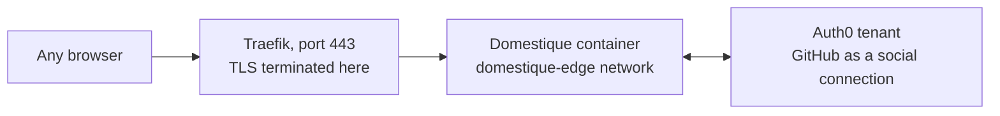

# Sign-in through Auth0

This guide describes how the service is reached, on a deployment that otherwise
follows [the Linux VM guide](hetzner.md). Auth0 is the **only** way in: the
operator signs in against a tenant this service verifies itself, and the
service publishes no other authenticated surface.

## What it looks like



Cloudflare Access, the Cloudflare Tunnel, and Tailscale Serve are gone from
this deployment. Traefik terminates TLS and forwards one service; it carries no
identity of its own, and the service never reads a header as if it did. Port
443 is the only one open on the host: domestique publishes to `127.0.0.1` for
the deploy script's health gate and is unreachable from outside.

## Auth0 tenant setup

Create one **Regular Web Application** in the tenant. A Regular Web
Application is the type that can hold a confidential client secret and
complete an authorisation-code exchange server-side, which is what this
service does — a Single Page Application or a Native application both assume
the client cannot keep a secret, and neither fits an application with no
public client-side code of its own.

- **Allowed Callback URLs** must be exactly `https://<host>/auth/callback` —
  the public hostname plus the one path this binary serves, with no trailing
  slash and no second entry. The service derives this URL itself from
  `http.browser_origin_url` and does not offer a choice of path.
- Add **GitHub** as a social connection and enable it for this application.
  It is the identity provider this deployment signs in through; the
  application accepts whatever connections are enabled for it, so enabling a
  second one widens who can attempt to sign in, not who is let in — the
  allowlist is the actual gate.
- **Disable the username/password database connection** for this application
  unless you actually want it. Left on, it is a second way to attempt
  sign-in with no policy this service imposes over it; GitHub alone keeps the
  surface to what one deployment actually uses.
- The identity this service checks is the ID token's `sub` claim, not an
  email address or a username. For the GitHub connection it reads
  `github|<github-user-id>`, a stable numeric ID rather than the account's
  current login name, so a GitHub username change never invalidates
  `allowed_subjects`.

## The reverse proxy

Traefik runs as a second service in the same compose project, and
[`compose.example.yml`](compose.example.yml) already carries it. It terminates
TLS for the public hostname, forwards to domestique over a private Docker
network, never routes the readiness listener, and never adds or trusts an
identity header — the service reads none, so an added one would be inert rather
than dangerous, but a proxy that trusted one from somewhere else would not be.

Three values go in `.env` beside the image digest:

```sh
DOMESTIQUE_IMAGE=ghcr.io/nobbs/domestique@sha256:<digest>
DOMESTIQUE_PUBLIC_HOST=domestique.example.com
DOMESTIQUE_ACME_EMAIL=you@example.com
```

The deploy script rewrites only the `DOMESTIQUE_IMAGE` line, so the other two
survive every deployment.

### One open port

The certificate is obtained over the **TLS-ALPN-01** challenge, which Let's
Encrypt answers on the port already being served. There is no `:80` entrypoint
and no DNS credential: the host firewall opens 443 and nothing else, which is
what [the Linux VM guide](hetzner.md) asks for. The cost is that
`http://<host>` does not answer at all rather than redirecting — every URL this
service hands out is already `https`, and `http.browser_origin_url` is
validated as HTTPS, so nothing generates a plaintext link to redirect.

The public DNS record must be a plain `A` record at this host. TLS-ALPN-01
cannot complete through a proxy that terminates TLS itself, so a Cloudflare
record left orange-clouded will fail issuance; use DNS-01 with a scoped API
token instead if the record has to stay proxied.

### What the labels say

Routing lives on the `domestique` service as labels, and Traefik reads them off
the Docker socket:

```yaml
labels:
  - "traefik.enable=true"
  - "traefik.http.routers.domestique.rule=Host(`${DOMESTIQUE_PUBLIC_HOST}`)"
  - "traefik.http.routers.domestique.entrypoints=websecure"
  - "traefik.http.routers.domestique.tls.certresolver=letsencrypt"
  - "traefik.http.services.domestique.loadbalancer.server.port=8080"
```

The load-balancer port is the **container** port. Traefik connects over the
`domestique-edge` network, not through the `127.0.0.1:8080` publish, which
exists for the deploy script's health gate. Because the route is a property of
the container, a deploy that recreates it re-registers the route on its own;
Traefik is never restarted by a deployment.

The readiness listener, `127.0.0.1:8081`, carries no label and is named nowhere
in the proxy at all — host-local health checking reaches it directly over
loopback. `GET /healthz` stays reachable through the proxy: it reads nothing
and returns static fields, so publishing it costs nothing. Hiding it would be a
courtesy against a port scan's first pass rather than a control, and Traefik
has no static-response primitive to hide it with.

### What the socket costs

Traefik runs as root and mounts `/var/run/docker.sock`. That is the price of
the label provider, and it is a real one: the mount is `:ro`, which stops
Traefik writing the socket file but does not restrain the daemon API behind it.
Anything that executes inside this container can reach the host as root.

So the two containers on this host are not equally trusted. `domestique` runs
unprivileged, read-only, with every capability dropped, because it parses
input from the internet. Traefik holds the socket, which is why it is
configured to do as little as possible: one entrypoint, no dashboard, no API,
`exposedbydefault=false`, and no plugins. A deployment that wants the socket
out of the picture entirely can put a read-only socket proxy in front of it, or
move to Traefik's file provider and drop the socket mount; neither changes
anything about how domestique is reached.

## First-time setup

A freshly deployed service has no way to be told a subject before one has
signed in, because the subject **is** what a sign-in reveals. The loop that
resolves that:

1. Put a placeholder value in `allowed_subjects` — anything syntactically
   valid — and start the service. Every real sign-in attempt will be refused;
   that is expected.
2. Sign in as the account that should hold operator rights.
3. The service refuses the placeholder subject and answers with its own 403
   page, which names the `sub` value it just refused. That page exists for
   exactly this: it is the one place this service will ever show a subject
   value, and it never writes that value to a log.
4. Copy that `sub` into `allowed_subjects`, replacing the placeholder, and
   restart. The allowlist is re-checked on every request, so the next sign-in
   attempt from that subject succeeds immediately.

Adding a second operator, or replacing the first, is the same loop: a
placeholder or an already-known `sub` goes in the list, and any subject not in
it is told its own value on refusal.

## Migrating from the Cloudflare Access path

For a deployment moving off the Cloudflare Tunnel and Access path documented
previously:

1. Register the Auth0 application and its callback URL as above.
2. Write `[auth.auth0]` into `config.toml` and provision the client secret
   file, on the terms [the configuration specification](specs/configuration.md#secret-input)
   states. `http.browser_origin_url` becomes the reverse proxy's public
   hostname if it was the Tailnet URL before.
3. Copy the current [`compose.example.yml`](compose.example.yml) over
   `compose.yml`, and add `DOMESTIQUE_PUBLIC_HOST` and `DOMESTIQUE_ACME_EMAIL`
   to `.env`. Traefik is a service in that file; there is no separate proxy to
   install.
4. Repoint DNS at this host as a plain `A` record — not proxied, or TLS-ALPN-01
   cannot complete — and open 443 on the host firewall. Certificate issuance
   needs the record to resolve here before Traefik first starts.
5. `docker compose --env-file .env up -d` brings up both services. Confirm the
   certificate was issued before going further: `docker compose logs traefik`
   is silent on success, and `curl -sI https://<host>/healthz` answers 200.
6. Complete first-time setup above, then stop `cloudflared` and remove its
   compose service.
7. Confirm with `ss -tlnp`, as [the Linux VM guide](hetzner.md) describes,
   that 443 is the only public listener and that both domestique ports are on
   `127.0.0.1` alone.
8. Remove the Cloudflare Access application and the tunnel from the Cloudflare
   account; there is nothing left to protect once DNS no longer points at it.
   Read the rollback note below first.

## Rollback

Rolling back across this migration needs the previous `[access.cloudflare]`
configuration restored **and** the Cloudflare Access application and tunnel
still in place — removing them in step 7 above forecloses a same-day
rollback. Keep them until the Auth0 path has run long enough to trust.
