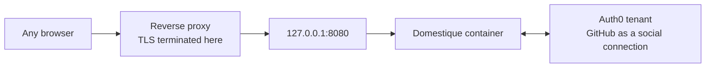

# Sign-in through Auth0

This guide describes how the service is reached, on a deployment that otherwise
follows [the Linux VM guide](hetzner.md). Auth0 is the **only** way in: the
operator signs in against a tenant this service verifies itself, and the
service publishes no other authenticated surface.

## What it looks like



Cloudflare Access, the Cloudflare Tunnel, and Tailscale Serve are gone from
this deployment. The proxy terminates TLS and forwards one port; it carries no
identity of its own, and the service never reads a header as if it did.

## Auth0 tenant setup

Create one **Regular Web Application** in the tenant. A Regular Web
Application is the type that can hold a confidential client secret and
complete an authorisation-code exchange server-side, which is what this
service does — a Single Page Application or a Native application both assume
the client cannot keep a secret, and neither fits an application with no
public client-side code of its own.

- **Allowed Callback URLs** must be exactly `https://<host>/auth/callback` —
  the public hostname plus the one path this binary serves, with no trailing
  slash and no second entry. The service derives this URL itself from
  `http.browser_origin_url` and does not offer a choice of path.
- Add **GitHub** as a social connection and enable it for this application.
  It is the identity provider this deployment signs in through; the
  application accepts whatever connections are enabled for it, so enabling a
  second one widens who can attempt to sign in, not who is let in — the
  allowlist is the actual gate.
- **Disable the username/password database connection** for this application
  unless you actually want it. Left on, it is a second way to attempt
  sign-in with no policy this service imposes over it; GitHub alone keeps the
  surface to what one deployment actually uses.
- The identity this service checks is the ID token's `sub` claim, not an
  email address or a username. For the GitHub connection it reads
  `github|<github-user-id>`, a stable numeric ID rather than the account's
  current login name, so a GitHub username change never invalidates
  `allowed_subjects`.

## The reverse proxy

Caddy is the documented example. It needs to terminate TLS, forward only to
`127.0.0.1:8080`, never forward the readiness listener, and never add or trust
an identity header — the service reads none, so an added one would be inert
rather than dangerous, but a proxy that trusted one from somewhere else would
not be.

```caddyfile
domestique.example.com {
    @healthz path /healthz
    respond @healthz 404

    reverse_proxy 127.0.0.1:8080
}
```

`GET /healthz` reads nothing and returns static fields, so it is safe to leave
reachable; 404ing it here is a courtesy that keeps it off a public port scan's
first pass; the service is correct either way. The readiness listener,
`127.0.0.1:8081`, is never named in this file at all — it has no route here
because host-local health checking reaches it directly over loopback.

## First-time setup

A freshly deployed service has no way to be told a subject before one has
signed in, because the subject **is** what a sign-in reveals. The loop that
resolves that:

1. Put a placeholder value in `allowed_subjects` — anything syntactically
   valid — and start the service. Every real sign-in attempt will be refused;
   that is expected.
2. Sign in as the account that should hold operator rights.
3. The service refuses the placeholder subject and answers with its own 403
   page, which names the `sub` value it just refused. That page exists for
   exactly this: it is the one place this service will ever show a subject
   value, and it never writes that value to a log.
4. Copy that `sub` into `allowed_subjects`, replacing the placeholder, and
   restart. The allowlist is re-checked on every request, so the next sign-in
   attempt from that subject succeeds immediately.

Adding a second operator, or replacing the first, is the same loop: a
placeholder or an already-known `sub` goes in the list, and any subject not in
it is told its own value on refusal.

## Migrating from the Cloudflare Access path

For a deployment moving off the Cloudflare Tunnel and Access path documented
previously:

1. Register the Auth0 application and its callback URL as above.
2. Write `[auth.auth0]` into `config.toml` and provision the client secret
   file, on the terms [the configuration specification](specs/configuration.md#secret-input)
   states. `http.browser_origin_url` becomes the reverse proxy's public
   hostname if it was the Tailnet URL before.
3. Deploy the reverse proxy in front of the host, pointed at
   `127.0.0.1:8080`, and confirm it terminates TLS for the public hostname.
4. Deploy the new service configuration and complete first-time setup above.
5. Repoint DNS at the reverse proxy host instead of the Cloudflare Tunnel.
6. Stop `cloudflared` and remove its compose service.
7. Remove the Cloudflare Access application and the tunnel from the
   Cloudflare account; there is nothing left to protect once DNS no longer
   points at it.
8. Open the host firewall to the reverse proxy's port only. The container
   itself still publishes to `127.0.0.1` alone; confirm with `ss -tlnp` as
   [the Linux VM guide](hetzner.md) describes.

## Rollback

Rolling back across this migration needs the previous `[access.cloudflare]`
configuration restored **and** the Cloudflare Access application and tunnel
still in place — removing them in step 7 above forecloses a same-day
rollback. Keep them until the Auth0 path has run long enough to trust.
