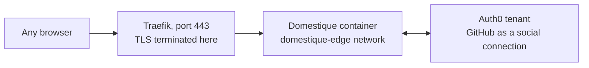

# Sign-in through Auth0

This guide describes how the service is reached, on a deployment that otherwise
follows [the Linux VM guide](hetzner.md). Auth0 is the **only** way in: the
operator signs in against a tenant this service verifies itself, and the
service publishes no other authenticated surface.

## What it looks like



Cloudflare Access, the Cloudflare Tunnel, and Tailscale Serve are gone from
this deployment. Traefik terminates TLS and forwards one service; it carries no
identity of its own, and the service never reads a header as if it did. Port
443 is the only one open on the host: domestique publishes to `127.0.0.1` for
the deploy script's health gate and is unreachable from outside.

## Auth0 tenant setup

Create one **Regular Web Application** in the tenant. A Regular Web
Application is the type that can hold a confidential client secret and
complete an authorisation-code exchange server-side, which is what this
service does — a Single Page Application or a Native application both assume
the client cannot keep a secret, and neither fits an application with no
public client-side code of its own.

- **Allowed Callback URLs** must be exactly `https://<host>/auth/callback` —
  the public hostname plus the one path this binary serves, with no trailing
  slash and no second entry. The service derives this URL itself from
  `http.browser_origin_url` and does not offer a choice of path.
- Add **GitHub** as a social connection and enable it for this application.
  It is the identity provider this deployment signs in through; the
  application accepts whatever connections are enabled for it, so enabling a
  second one widens who can attempt to sign in, not who is let in — the
  post-login Action below is the actual gate.
- **Disable the username/password database connection** for this application
  unless you actually want it. Left on, it is a second way to attempt
  sign-in with no policy this service imposes over it; GitHub alone keeps the
  surface to what one deployment actually uses.
- The identity this service checks is the ID token's `sub` claim, not an
  email address or a username. For the GitHub connection it reads
  `github|<github-user-id>`, a stable numeric ID rather than the account's
  current login name, so a GitHub username change never invalidates the
  Action's own list.
- The standard `nickname` claim, when the connection sets one, is read at
  sign-in and stored beside the subject purely as a display label next to it
  on the settings page. It is never a key: ownership and admin comparisons
  stay on subject alone, and nothing looks a rider up by nickname.

## The reverse proxy

Traefik runs as a second service in the same compose project, and
[`compose.example.yml`](compose.example.yml) already carries it. It terminates
TLS for the public hostname, forwards to domestique over a private Docker
network, never routes the readiness listener, and never adds or trusts an
identity header — the service reads none, so an added one would be inert rather
than dangerous, but a proxy that trusted one from somewhere else would not be.

Two values join the image digest in `.env`, shown here with it for context:

```sh
DOMESTIQUE_IMAGE=ghcr.io/nobbs/domestique@sha256:<digest>
DOMESTIQUE_PUBLIC_HOST=domestique.example.com
DOMESTIQUE_ACME_EMAIL=you@example.com
```

The deploy script rewrites only the `DOMESTIQUE_IMAGE` line, so the other two
survive every deployment.

### One open port

The certificate is obtained over the **TLS-ALPN-01** challenge, which Let's
Encrypt answers on the port already being served. There is no `:80` entrypoint
and no DNS credential: the host firewall opens 443 and nothing else, which is
what [the Linux VM guide](hetzner.md) asks for. The cost is that
`http://<host>` does not answer at all rather than redirecting — every URL this
service hands out is already `https`, and `http.browser_origin_url` is
validated as HTTPS, so nothing generates a plaintext link to redirect.

The public DNS record must be a plain `A` record at this host. TLS-ALPN-01
cannot complete through a proxy that terminates TLS itself, so a Cloudflare
record left orange-clouded will fail issuance; use DNS-01 with a scoped API
token instead if the record has to stay proxied.

### What the labels say

Routing lives on the `domestique` service as labels, and Traefik reads them off
the Docker socket:

```yaml
labels:
  - "traefik.enable=true"
  - "traefik.http.routers.domestique.rule=Host(`${DOMESTIQUE_PUBLIC_HOST}`)"
  - "traefik.http.routers.domestique.entrypoints=websecure"
  - "traefik.http.routers.domestique.tls.certresolver=letsencrypt"
  - "traefik.http.services.domestique.loadbalancer.server.port=8080"
```

The load-balancer port is the **container** port. Traefik connects over the
`domestique-edge` network, not through the `127.0.0.1:8080` publish, which
exists for the deploy script's health gate. Because the route is a property of
the container, a deploy that recreates it re-registers the route on its own;
Traefik is never restarted by a deployment.

The readiness listener, `127.0.0.1:8081`, carries no label and is named nowhere
in the proxy at all — host-local health checking reaches it directly over
loopback. `GET /healthz` stays reachable through the proxy: it reads nothing
and returns static fields, so publishing it costs nothing. Hiding it would be a
courtesy against a port scan's first pass rather than a control, and Traefik
has no static-response primitive to hide it with.

### What the socket costs

Traefik runs as root and mounts `/var/run/docker.sock`. That is the price of
the label provider, and it is a real one: the mount is `:ro`, which stops
Traefik writing the socket file but does not restrain the daemon API behind it.
Anything that executes inside this container can reach the host as root.

So the two containers on this host are not equally trusted. `domestique` runs
unprivileged, read-only, with every capability dropped, because it parses
input from the internet. Traefik holds the socket, which is why it is
configured to do as little as possible: one entrypoint, no dashboard, no API,
`exposedbydefault=false`, and no plugins. A deployment that wants the socket
out of the picture entirely can put a read-only socket proxy in front of it, or
move to Traefik's file provider and drop the socket mount; neither changes
anything about how domestique is reached.

## Who may sign in: the post-login Action

Domestique holds no roster of its own. A post-login Action in the tenant
decides who may sign in at all, and separately, who among them holds
cross-subject rights — asserted as two namespaced claims on the ID token this
service reads and nothing more:

```js
exports.onExecutePostLogin = async (event, api) => {
  const ACCESS = ["github|123456"];
  const ADMIN = ["github|123456"];
  if (!ACCESS.includes(event.user.user_id)) {
    api.access.deny("not_allowed", "This account is not allowed to sign in.");
    return;
  }
  const ns = "https://domestique.invalid/";
  api.idToken.setCustomClaim(`${ns}access`, true);
  api.idToken.setCustomClaim(`${ns}admin`, ADMIN.includes(event.user.user_id));
};
```

`https://domestique.invalid/` names the claims: Auth0 requires custom claims
to be namespaced URIs, and `.invalid` is the TLD RFC 2606 reserves so it can
never resolve or imply a domain this project doesn't own. `api.access.deny`
refuses the sign-in at Auth0 itself — the browser lands back on
`/auth/callback?error=access_denied` without a code ever being issued, and
this service never sees the attempt. The `access` claim is asserted anyway,
as a fail-closed fallback: if the Action is ever disabled or removed, no
token carries it, and every subject is refused rather than every subject
being admitted.

Attach the Action to the tenant's **Login** flow (Actions → Flows → Login),
after any other Actions that need to run first.

### First-time setup

A freshly created tenant has no way to be told a subject before one has
signed in, because the subject **is** what a sign-in reveals:

1. Deploy the Action with a placeholder in `ACCESS` — anything syntactically
   valid. Every real sign-in attempt will be refused; that is expected.
2. Sign in as the account that should hold access.
3. Denied at the Action, the callback carries no subject to read — but this
   service's own fallback check (`access` claim absent) is not what fires
   here; nothing reaches it. Read the refused subject from the Auth0 tenant's
   own login logs instead (Monitoring → Logs, a **Failed Login** entry naming
   the `user_id`), or temporarily comment out the `deny` call to let the
   sign-in complete and read the `sub` from this service's own 403 page —
   the one place it will ever show a subject value, and it never writes one
   to a log.
4. Add that `sub` to `ACCESS` (and `ADMIN`, if this operator should hold
   cross-subject rights) in place of the placeholder, and deploy the Action
   again. It takes effect on the next sign-in — no restart of this service is
   needed, since nothing here holds a copy of the list.

Adding a second subject, or changing who holds admin, is the same edit: update
the arrays and deploy.

## Migrating from the Cloudflare Access path

For a deployment moving off the Cloudflare Tunnel and Access path documented
previously:

1. Register the Auth0 application and its callback URL as above.
2. Write `[auth.auth0]` into `config.toml` and provision the client secret
   file, on the terms [the configuration specification](specs/configuration.md#secret-input)
   states. `http.browser_origin_url` becomes the reverse proxy's public
   hostname if it was the Tailnet URL before.
3. Copy the current [`compose.example.yml`](compose.example.yml) over
   `compose.yml`, and add `DOMESTIQUE_PUBLIC_HOST` and `DOMESTIQUE_ACME_EMAIL`
   to `.env`. Traefik is a service in that file; there is no separate proxy to
   install.
4. Repoint DNS at this host as a plain `A` record — not proxied, or TLS-ALPN-01
   cannot complete — and open 443 on the host firewall. Certificate issuance
   needs the record to resolve here before Traefik first starts.
5. `docker compose --env-file .env up -d` brings up both services. Confirm the
   certificate was issued before going further: `curl -sI https://<host>/healthz`
   answering 200 is the proof. Traefik logs its startup and configuration at
   INFO either way, so read `docker compose logs traefik` for an ACME error
   rather than for silence.
6. Complete first-time setup above, then stop `cloudflared` and remove its
   compose service.
7. Confirm with `ss -tlnp`, as [the Linux VM guide](hetzner.md) describes,
   that 443 is the only public listener and that both domestique ports are on
   `127.0.0.1` alone.
8. Remove the Cloudflare Access application and the tunnel from the Cloudflare
   account; there is nothing left to protect once DNS no longer points at it.
   Read the rollback note below first.

## Rollback

Rolling back across this migration needs the previous `[access.cloudflare]`
configuration restored **and** the Cloudflare Access application and tunnel
still in place — removing them in step 8 above forecloses a same-day
rollback. Keep them until the Auth0 path has run long enough to trust.

### The deploy script cannot roll this one back on its own

`config.toml` and the image have to move together, in one step. The release
that introduces `[auth.auth0]` refuses `[access]` as an unknown key, and the
release before it refuses `[auth.auth0]` for the same reason, so whichever file
changes first leaves the service unable to start.

That matters because `domestique-deploy.sh` restores the **image** when its
health gate fails and leaves `config.toml` exactly where it found it. Deploying
this release against a host still holding `[access]` therefore does the right
thing — the new image fails to start, the previous digest comes back, and the
host stays up on Cloudflare Access:

```text
loading configuration: decoding configuration:
'config.rawSettings' has invalid keys: access
```

Migrating `config.toml` first and *then* letting CI deploy does not. The new
image would start, but any later rollback — automatic or by hand — would put
the previous image back underneath a config it cannot parse, and the host would
stay down until someone restored the file too.

So run the cutover as one operation that owns both files: back up `config.toml`,
write the new one, deploy the digest, and on any failure restore the file
*before* returning the host to the previous image. Verify with `GET /`
answering `302` to `/auth/login`; the health probe alone cannot tell the two
releases apart, because both answer it.
