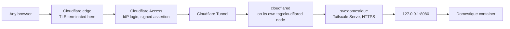

# Public access through Cloudflare Access

This guide describes how the service is reached, on a deployment that otherwise
follows [the Linux VM guide](hetzner.md). Cloudflare Access is the **only** way
in: the operator authenticates to an external identity provider from any
browser, and the service publishes no listener.

This applies to Tailnet browsers too. Tailscale Serve still fronts the
listener, because `cloudflared` reaches it by Service name, and Tailnet members
can still reach that URL. The service reads no Tailnet identity, so such a
request answers 401 like any other without an assertion. There is one front
door.

## What it looks like



The origin is the **Tailscale Service name**, not a node name. See
[The Service name](#the-service-name).

Cloudflare terminates TLS at its edge and can therefore see plaintext.

## Constraints

Tailscale Funnel cannot serve this deployment:

- Funnel binds to the **node's** MagicDNS name. It cannot serve a Tailscale
  Service name; `--service=svc:` is a Serve-only flag that Funnel ignores.
- Funnel has **no authentication and no authorization**. The `funnel` nodeAttr
  in the policy file controls who may *publish*, not who may *connect*. An
  internet client carries no tailnet identity, so a grant has nothing to
  evaluate.
- Funnel injects no identity headers, and this service's gate needs an identity.

## The trust model

One kind of evidence reaches the handler, and it is checked on every request.

| Evidence | What makes it trustworthy |
| --- | --- |
| `Cf-Access-Jwt-Assertion` | RS256 signature over Cloudflare's published keys, bound to this application's audience tag |

It resolves to the single configured principal,
`access.cloudflare.allowed_email`, and the service stays single-tenant.

**cloudflared has no identity of its own.** It runs on a tagged node, and
Tailscale Serve never populates identity headers for a tagged device. A request
arriving through the tunnel carries no `Tailscale-User-Login` at all. The signed
assertion is the only identity it carries.

**The application verifies the assertion itself**, rather than trusting that
something upstream did. Verification checks the signature, the issuer, the
expiry, and that `aud` matches this application's audience tag. Without the
audience check, a token minted for any other Access application in the same
Cloudflare team would verify against the same signing key.
`Cf-Access-Authenticated-User-Email` is never consulted: it is unsigned.

**`Tailscale-User-Login` is not read.** This must stay that way. Serve is still
listening and Tailnet members can still reach it, so honouring that header would
be a second front door with a second identity source behind it. A tunnel
forwards client headers verbatim: the moment anything other than Serve reaches
the listener, the header is forgeable. One identity, verified by signature, on
every request.

### The Service name

The ingress rule names `svc:domestique`, not a node and not loopback.

- The Service name outlives the host. Moving the service to another machine is
  a Serve change on the new host, not a tunnel change.
- The tunnel node's grant is written against that Service, so `tag:cloudflared`
  reaches exactly one Service on exactly one port and cannot address the host it
  runs beside. Pointing the ingress rule at `127.0.0.1:8080` discards that
  containment.

Do not simplify the ingress rule to loopback.

## Tailnet policy

These changes belong to the `infrastructure` repository, in
`stacks/tailscale/policy.hujson`. The existing `acls` block stays as it is;
`grants` may sit alongside it, and service destinations need the grants syntax.

```hujson
"tagOwners": {
    "tag:cloudflared": ["nobbs@github"],
    // ... existing tags unchanged
},

"grants": [
    // The public-facing node reaches exactly one service on exactly one port.
    // Compromising it is not compromising the tailnet.
    {
        "src": ["tag:cloudflared"],
        "dst": ["svc:domestique"],
        "ip":  ["tcp:443"],
    },
],
```

The tunnel node is absent from every other rule. It is not a `tag:homelab`
peer, it advertises nothing, and it has no SSH grant.

Add a policy test that pins the negative case:

```hujson
"tests": [
    {
        "src":    "tag:cloudflared",
        "accept": ["svc:domestique:443"],
        "deny":   ["tag:domestique:22", "tag:domestique:8080", "tag:homelab:443"],
    },
],
```

Confirm the positive direction in the policy editor before applying; test
support for `svc:` destinations should be checked against the current syntax
rather than assumed.

The `services` map in `stacks/tailscale/terraform.tfvars` publishes
`svc:domestique` on `tcp:443` only.

## Cloudflare setup

Everything on the Cloudflare side is Terraform, in
`infrastructure/stacks/cloudflare/domestique.tf`: the tunnel, the hostname's
`CNAME`, the Access group, policy and application, and a redirect rule scoped to
this hostname. That stack does not own the ingress rule, which lives in
[`cloudflared.example.yml`](cloudflared.example.yml) beside the compose file
that deploys it. The origin is a Tailscale Service name, and that line has one
copy.

Two prerequisites are one-time dashboard work, not Terraform:

- **Zero Trust enabled**, with a team domain. Terraform can create an
  application inside an organization but cannot create the organization.
  Organizations created since June 2026 get the **Cloudflare identity provider**
  as their default login method: the operator authenticates with their
  Cloudflare account credentials, and login is restricted to members of that
  account. One-time PIN is no longer added automatically. Either way, the
  address the identity provider asserts has to be the one in
  `var.domestique.allowed_emails` *and* in `access.cloudflare.allowed_email`; if
  the Cloudflare account's login address differs from the operator's, nothing
  matches and nobody gets in.
- **Both Cloudflare API tokens widened.** The tunnel and the Access resources
  are account-scoped rather than zone-scoped, and the redirect rule needs
  `Single Redirect`. The exact permissions are in that stack's README.

Then:

1. **Apply the stack.** From the infrastructure root, `mise run terraform:apply
   cloudflare`, or merge to `main` and let CI apply it. This creates the tunnel,
   points `domestique.nobbs.dev` at it, and creates the Access application.
2. **Take the two values the host needs**, from the stack's outputs rather than
   from the dashboard:

   - `domestique_tunnel_id` — the tunnel ID for `cloudflared`'s `config.yml`.
   - `domestique_access_aud` — the AUD tag, for
     `access.cloudflare.application_aud` below.
   - `domestique_access_team_domain` — for `access.cloudflare.team_domain`. The
     organization stays dashboard-managed, and the stack reads it, so this is
     not transcribed by hand either.
3. **Fetch the connector credentials.** `tunnel_secret` is left unset in
   Terraform, so Cloudflare generates it and it never enters the state file. The
   dashboard offers no download for it either — a locally configured tunnel has
   no *Configure* tab, only a *Migrate* one — so ask `cloudflared` for it, which
   writes the credentials file directly:

   ```sh
   # Once per host, if there is no ~/.cloudflared/cert.pem yet.
   cloudflared tunnel login
   cloudflared tunnel token --cred-file /etc/cloudflared/<TUNNEL_ID>.json <TUNNEL_ID>
   ```

   That page's **Start migration** button must not be pressed. It is
   irreversible, and it moves the ingress rules to dashboard management. The
   ingress is what names `svc:domestique`.
4. **Deploy the connector.** Copy
   [`cloudflared.example.yml`](cloudflared.example.yml) to
   `./cloudflared/config.yml`, fill in the tunnel ID, and place the credentials
   JSON beside it. Bring up
   [`compose.cloudflare.example.yml`](compose.cloudflare.example.yml) alongside
   the service's own compose file. Its Tailscale sidecar must join with an auth
   key carrying `tag:cloudflared`, which is the tag the grant above is written
   against.
5. **Approve the tunnel node** for the Service if the tailnet requires it, then
   confirm from inside the namespace that the Service resolves:

   ```sh
   docker compose exec tunnel-tailscale tailscale status
   docker compose exec tunnel-tailscale tailscale ping domestique.fluffy-sargas.ts.net
   ```

### What the Terraform sets

Four of the choices in it are decisions rather than defaults:

- **A group, not a list of addresses on the policy.** The allowed people are
  named once in `var.domestique.allowed_emails`, and the policy references the
  group. Membership changes in one place.
- **A session duration of a day.**
- **The app launcher left visible**, so the service appears on a single page
  listing what the account can reach.
- **`allowed_idps` left unset**, so the application accepts every login method
  the organization offers. Today that is one, the Cloudflare identity provider,
  which admits only members of the Cloudflare account. Pin the list when a
  second provider is added: two providers can assert two different addresses for
  one person, only one of those matches `access.cloudflare.allowed_email`, and
  an unpinned application gains a login path that authenticates and is then
  refused.

Access is the outer of two gates. Widening the group does not widen who the
application will serve: Domestique still verifies each request's signed
assertion against its own `allowed_email`.

### One application

This service needs one Access application, an Allow path for the UI.

- **No Bypass path.** Domestique exposes no webhook endpoint. A Bypass rule is
  public and unlogged.
- **No Service Auth path.** Service Auth is satisfied by
  `Cf-Access-Client-Id` / `Cf-Access-Client-Secret` headers, and **not** by the
  browser's Access cookie. The browser UI calls `/v1/*` on this same origin, so
  putting `/v1/*` behind Service Auth locks the UI out of its own API. A machine
  client, if one is ever wanted, gets a path prefix of its own rather than
  reusing `/v1/*`.

If a path-scoped application is added later, the more specific path wins and
inherits nothing from the domain-level application.

## Service configuration

Add the section to `config.toml` on the host:

```toml
[access.cloudflare]
team_domain = "<team>.cloudflareaccess.com"
application_aud = "<the AUD tag of the Access application>"
allowed_email = "<the IdP address of the operator>"
```

`team_domain` and `application_aud` are the `domestique_access_team_domain` and
`domestique_access_aud` outputs of the Cloudflare stack. None of these is a
secret, so they live in `config.toml` rather than in `secrets/`. The section is
required in full: it is the only gate the service has, and a missing or partly
filled one is refused at startup.

### The Wahoo redirect

The OAuth callback lands in an ordinary browser. Set `http.browser_origin_url`
to `https://domestique.nobbs.dev`, and the callback registered with Wahoo to:

```text
https://domestique.nobbs.dev/oauth/wahoo/callback
```

The service derives the second from the first, so only the Wahoo application
has to be told it separately.

The OAuth state is bound to the calling identity, so the flow's two requests
must agree on who the caller is. The gate hands downstream the configured
address rather than the spelling the assertion happened to use, which holds if
Access varies the case between assertions. Do not replace that with the raw
claim value.

## Verify the result

After deploying, check each of these:

```sh
# The container still publishes to loopback only.
ss -tlnp | grep 8080

# The public hostname redirects an anonymous browser to the IdP, and never
# returns service content.
curl -sS -o /dev/null -w '%{http_code} %{redirect_url}\n' https://domestique.nobbs.dev/v1/status

# Serve is reachable from the Tailnet but is not a way in: 401, not content,
# and a forged identity header changes nothing.
curl -sS -o /dev/null -w '%{http_code}\n' https://domestique.fluffy-sargas.ts.net/v1/status
curl -sS -o /dev/null -w '%{http_code}\n' \
  -H 'Tailscale-User-Login: you@example.com' \
  https://domestique.fluffy-sargas.ts.net/v1/status

# The tunnel node cannot reach anything else in the tailnet.
docker compose exec tunnel-tailscale tailscale ping homelab
```

Then, from a browser off the Tailnet, sign in and confirm `/v1/status` answers.
From a Tailnet browser, confirm it still answers without a Cloudflare session.

A negative test: temporarily set `application_aud` to another application's tag
and confirm the service returns 401 to an otherwise valid session. That proves
the audience check is running.

## Cost and limits

Cloudflare Zero Trust's free tier covers 50 users at no charge; pay-as-you-go is
$7 per user per month beyond it. A seat is consumed by an authentication event
and held until the user is removed or auto-expires. Log retention on the free
tier is 24 hours, and support is the community forum. The Cloudflare audit log
is not a durable record, and anything worth keeping is observable from the
service itself.

WebSockets and server-sent events pass through Tunnel and Access without
additional configuration.

## A caveat about this deployment

`cloudflared` belongs on a dedicated node, so that compromising the
public-facing process is not compromising the service. Here it runs in its own
container, with its own tailnet identity and its own tag, but on the **same
physical host** as the service it fronts.

That is a real weakening. The `tag:cloudflared` grant limits what the tunnel
node can reach *over the tailnet*, but a process that escapes its container is
already on the host that terminates the Service. The isolation is meaningful
against a compromised `cloudflared` process, and not against a container escape.

Moving these two containers to their own small VM in the `hetzner` stack closes
that gap and changes nothing else in this guide: the config, the grants, and the
service configuration are all placement independent. It is the recommended next
step if this path is kept.
