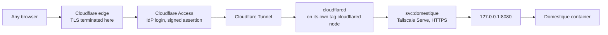

# Public access through Cloudflare Access

This guide describes how the service is reached, on a deployment that otherwise
follows [the Linux VM guide](hetzner.md). Cloudflare Access is the **only** way
in: the operator authenticates to an external identity provider from any
browser, and the service publishes no listener.

This applies to Tailnet browsers too. Tailscale Serve still fronts the
listener, because `cloudflared` reaches it by Service name, and Tailnet members
can still reach that URL — but the service reads no Tailnet identity, so such a
request answers 401 like any other without an assertion. There is one front
door.

## What it looks like



The origin is the **Tailscale Service name**, not a node name. That indirection
is why the service can move hosts without the tunnel changing, and it is also
what keeps the deployment safe — see [Why the Service name is load-bearing](#why-the-service-name-is-load-bearing).

## Why not Tailscale Funnel

Funnel is the obvious-looking answer and it does not work here.

- Funnel binds to the **node's** MagicDNS name. It cannot serve a Tailscale
  Service name; `--service=svc:` is a Serve-only flag that Funnel ignores. The
  whole point of `svc:domestique` is that the name outlives the host.
- Funnel has **no authentication and no authorization**. The `funnel` nodeAttr
  in the policy file controls who may *publish*, not who may *connect*. An
  internet client carries no tailnet identity, so a grant has nothing to
  evaluate.
- Funnel injects no identity headers, and this service's gate needs an identity.

The trade this makes is real and worth stating: Cloudflare terminates TLS and
can therefore see plaintext, where Funnel proxies TCP without terminating it.
For a route-mirroring service whose sensitive payload is already gated behind a
verified identity, that is an acceptable price for having authentication at all.

## The trust model

One kind of evidence reaches the handler, and it is checked on every request.

| Evidence | Why it can be trusted |
| --- | --- |
| `Cf-Access-Jwt-Assertion` | RS256 signature over Cloudflare's published keys, bound to this application's audience tag |

It resolves to the single configured principal,
`access.cloudflare.allowed_email`, and the service stays single-tenant.

Three consequences are worth holding on to.

**cloudflared has no identity of its own.** It runs on a tagged node, and
Tailscale Serve never populates identity headers for a tagged device. A request
arriving through the tunnel carries no `Tailscale-User-Login` at all. The signed
assertion is the only identity it carries.

**The application verifies the assertion itself**, rather than trusting that
something upstream did. Verification checks the signature, the issuer, the
expiry, and — critically — that `aud` matches this application's audience tag.
Without the audience check, a token minted for any other Access application in
the same Cloudflare team would verify against the same signing key.
`Cf-Access-Authenticated-User-Email` is never consulted: it is unsigned.

**`Tailscale-User-Login` is not read.** This is deliberate and must stay that
way. Serve is still listening and Tailnet members can still reach it, so
honouring that header would mean a second front door with a second identity
source behind it. Worse, a tunnel forwards client headers verbatim: the moment
anything other than Serve reaches the listener, the header becomes forgeable and
the gate becomes a formality. One identity, verified by signature, on every
request.

### Why the Service name is load-bearing

The ingress rule names `svc:domestique`, not a node and not loopback. Two
reasons:

- The Service name outlives the host. Moving the service to another machine is
  a Serve change on the new host, not a tunnel change.
- The tunnel node's grant is written against that Service, so `tag:cloudflared`
  can reach exactly one Service on exactly one port and cannot address the host
  it happens to run beside. Pointing the ingress rule at `127.0.0.1:8080` would
  discard that containment for nothing.

Do not "simplify" the ingress rule to loopback.

## Tailnet policy

These changes belong to the `infrastructure` repository, in
`stacks/tailscale/policy.hujson`. The existing `acls` block stays as it is;
`grants` may sit alongside it, and service destinations need the grants syntax.

```hujson
"tagOwners": {
    "tag:cloudflared": ["nobbs@github"],
    // ... existing tags unchanged
},

"grants": [
    // The public-facing node reaches exactly one service on exactly one port.
    // Compromising it is not compromising the tailnet.
    {
        "src": ["tag:cloudflared"],
        "dst": ["svc:domestique"],
        "ip":  ["tcp:443"],
    },
],
```

The tunnel node is deliberately absent from every other rule. It is not a
`tag:homelab` peer, it advertises nothing, and it has no SSH grant.

Add a policy test that pins the negative case, which is the one that matters:

```hujson
"tests": [
    {
        "src":  "tag:cloudflared",
        "deny": ["tag:homelab:443", "tag:domestique:22"],
    },
],
```

Confirm the positive direction in the policy editor before applying; test
support for `svc:` destinations should be checked against the current syntax
rather than assumed.

The `services` map in `stacks/tailscale/terraform.tfvars` already publishes
`svc:domestique` on `tcp:443` and `tcp:8080`. Nothing there needs to change —
the grant restricts the tunnel node to 443 regardless.

## Cloudflare setup

Everything on the Cloudflare side is Terraform, in
`infrastructure/stacks/cloudflare/domestique.tf`: the tunnel, the hostname's
`CNAME`, the Access group, policy and application, and a redirect rule scoped to
this hostname. The one thing that stack deliberately does not own is the ingress
rule, which lives in [`cloudflared.example.yml`](cloudflared.example.yml) beside
the compose file that deploys it — because the origin is a Tailscale Service
name, and that is the line least worth having two copies of.

Two prerequisites are one-time dashboard work, not Terraform:

- **Zero Trust enabled**, with a team domain. Terraform can create an
  application inside an organization but cannot create the organization.
  Organizations created since June 2026 get the **Cloudflare identity provider**
  as their default login method: the operator authenticates with their
  Cloudflare account credentials, and login is restricted to members of that
  account. One-time PIN is no longer added automatically. Either way, the
  address the identity provider asserts has to be the one in
  `var.domestique.allowed_emails` *and* in `access.cloudflare.allowed_email`; if
  the Cloudflare account's login address differs from the operator's, nothing
  matches and nobody gets in.
- **Both Cloudflare API tokens widened.** They were zone-scoped; the tunnel and
  the Access resources are account-scoped, and the redirect rule needs
  `Single Redirect`. The exact permissions are in that stack's README.

Then:

1. **Apply the stack.** From the infrastructure root, `mise run terraform:apply
   cloudflare`, or merge to `main` and let CI apply it. This creates the tunnel,
   points `domestique.nobbs.dev` at it, and creates the Access application.
2. **Take the two values the host needs**, from the stack's outputs rather than
   from the dashboard:

   - `domestique_tunnel_id` — the tunnel ID for `cloudflared`'s `config.yml`.
   - `domestique_access_aud` — the AUD tag, for
     `access.cloudflare.application_aud` below.
   - `domestique_access_team_domain` — for `access.cloudflare.team_domain`. The
     organization stays dashboard-managed, but the stack reads it, so this is
     not transcribed by hand either.
3. **Fetch the connector credentials.** `tunnel_secret` is intentionally left
   unset in Terraform, so Cloudflare generates it and it never enters the state
   file. Download the credentials JSON once from Zero Trust → Networks →
   Tunnels.
4. **Deploy the connector.** Copy
   [`cloudflared.example.yml`](cloudflared.example.yml) to
   `./cloudflared/config.yml`, fill in the tunnel ID, and place the credentials
   JSON beside it. Bring up
   [`compose.cloudflare.example.yml`](compose.cloudflare.example.yml) alongside
   the service's own compose file. Its Tailscale sidecar must join with an auth
   key carrying `tag:cloudflared`, since that tag is what the grant above is
   written against.
5. **Approve the tunnel node** for the Service if the tailnet requires it, then
   confirm from inside the namespace that the Service resolves:

   ```sh
   docker compose exec tunnel-tailscale tailscale status
   docker compose exec tunnel-tailscale tailscale ping domestique.fluffy-sargas.ts.net
   ```

### What the Terraform sets, and why

The resources are small enough to read, but three of the choices in them are
decisions rather than defaults:

- **A group, not a list of addresses on the policy.** The allowed people are
  named once in `var.domestique.allowed_emails`, and the policy references the
  group. Membership then changes in one place.
- **A session duration of a day.** Cloudflare's default is short for a service
  one person uses daily; a day or a week is appropriate for a single trusted
  operator.
- **The app launcher left visible**, so the service appears on a single page
  listing what the account can reach.

Access is the outer of two gates in any case. Widening the group does not widen
who the application will serve: Domestique still verifies each request's signed
assertion against its own `allowed_email`.

### Only one application, deliberately

The general shape of this setup often has three applications — a Bypass path for
webhooks, a Service Auth path for machine clients, and an Allow path for the UI.
This service needs only the third, and adding the others would be a mistake
here.

- **No Bypass path.** Domestique exposes no webhook endpoint. A Bypass rule is
  genuinely public and unlogged, so creating one without an endpoint that needs
  it is pure attack surface.
- **No Service Auth path.** Service Auth is satisfied by
  `Cf-Access-Client-Id` / `Cf-Access-Client-Secret` headers, and **not** by the
  browser's Access cookie. The browser UI calls `/v1/*` on this same origin, so
  putting `/v1/*` behind Service Auth would lock the UI out of its own API. If a
  machine client is ever wanted, give it a path prefix of its own rather than
  reusing `/v1/*`.

If a path-scoped application is added later, remember that the more specific
path wins and inherits nothing from the domain-level application.

## Service configuration

Add the section to `config.toml` on the host:

```toml
[access.cloudflare]
team_domain = "<team>.cloudflareaccess.com"
application_aud = "<the AUD tag of the Access application>"
allowed_email = "<the IdP address of the operator>"
```

`team_domain` and `application_aud` are the `domestique_access_team_domain` and
`domestique_access_aud` outputs of the Cloudflare stack. None of these is a
secret, so they live in `config.toml` rather than in `secrets/`. The section is required in full: it is the only gate the service
has, so a missing or partly filled one is refused at startup rather than left
answering every request with a 401.

### The Wahoo redirect moves

The OAuth callback lands in an ordinary browser. Set both `wahoo.redirect_url`
and the callback registered with Wahoo to:

```text
https://domestique.nobbs.dev/oauth/wahoo/callback
```

The OAuth state is bound to the calling identity, so the flow's two requests
must agree on who the caller is. The gate hands downstream the configured
address rather than the spelling the assertion happened to use, which keeps that
true if Access varies the case between assertions. Do not replace that with the
raw claim value.

## Verify the result

After deploying, check each of these:

```sh
# The container still publishes to loopback only.
ss -tlnp | grep 8080

# The public hostname redirects an anonymous browser to the IdP, and never
# returns service content.
curl -sS -o /dev/null -w '%{http_code} %{redirect_url}\n' https://domestique.nobbs.dev/v1/status

# Serve is reachable from the Tailnet but is not a way in: 401, not content,
# and a forged identity header changes nothing.
curl -sS -o /dev/null -w '%{http_code}\n' https://domestique.fluffy-sargas.ts.net/v1/status
curl -sS -o /dev/null -w '%{http_code}\n' \
  -H 'Tailscale-User-Login: you@example.com' \
  https://domestique.fluffy-sargas.ts.net/v1/status

# The tunnel node cannot reach anything else in the tailnet.
docker compose exec tunnel-tailscale tailscale ping homelab
```

Then, from a browser off the Tailnet, sign in and confirm `/v1/status` answers.
From a Tailnet browser, confirm it still answers without a Cloudflare session.

A useful negative test: temporarily set `application_aud` to another
application's tag and confirm the service returns 401 to an otherwise valid
session. That proves the audience check is actually running.

## Cost and limits

Cloudflare Zero Trust's free tier covers 50 users at no charge, which is far
more than this needs; pay-as-you-go is $7 per user per month beyond it. A seat
is consumed by an authentication event and held until the user is removed or
auto-expires. Log retention on the free tier is 24 hours, and support is the
community forum — so the Cloudflare audit log is not a durable record, and
anything worth keeping should be observable from the service itself.

WebSockets and server-sent events pass through Tunnel and Access without
additional configuration, should the UI ever want a live stream.

## A caveat about this deployment

The task this setup was designed against calls for `cloudflared` on a dedicated
node, so that compromising the public-facing process is not compromising the
service. Here it runs in its own container, with its own tailnet identity and
its own tag, but on the **same physical host** as the service it fronts.

That is a real weakening and it should be named rather than glossed. The
`tag:cloudflared` grant genuinely limits what the tunnel node can reach *over
the tailnet*, but a process that escapes its container is already on the host
that terminates the Service. The isolation is meaningful against a compromised
`cloudflared` process, and not against a container escape.

Moving these two containers to their own small VM in the `hetzner` stack would
close that gap and would change nothing else in this guide — the config, the
grants, and the service configuration are all written to be placement
independent. It is the recommended next step if this path is kept.
