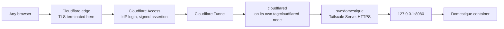

# Public access through Cloudflare Access

This guide adds an optional public path to a deployment that otherwise follows
[the Linux VM guide](hetzner.md). It lets the configured operator reach the
service from a browser that is not on the Tailnet, authenticated by an external
identity provider, without publishing a listener.

Nothing here changes the Tailnet path. With `[access.cloudflare]` absent from
`config.toml`, the service behaves exactly as it did before, and the rest of
this document does not apply.

## What it looks like



The origin is the **Tailscale Service name**, not a node name. That indirection
is why the service can move hosts without the tunnel changing, and it is also
what keeps the deployment safe — see [Why the Service name is load-bearing](#why-the-service-name-is-load-bearing).

## Why not Tailscale Funnel

Funnel is the obvious-looking answer and it does not work here.

- Funnel binds to the **node's** MagicDNS name. It cannot serve a Tailscale
  Service name; `--service=svc:` is a Serve-only flag that Funnel ignores. The
  whole point of `svc:domestique` is that the name outlives the host.
- Funnel has **no authentication and no authorization**. The `funnel` nodeAttr
  in the policy file controls who may *publish*, not who may *connect*. An
  internet client carries no tailnet identity, so a grant has nothing to
  evaluate.
- Funnel injects no identity headers, and this service's gate needs an identity.

The trade this makes is real and worth stating: Cloudflare terminates TLS and
can therefore see plaintext, where Funnel proxies TCP without terminating it.
For a route-mirroring service whose sensitive payload is already gated behind a
verified identity, that is an acceptable price for having authentication at all.

## The trust model

Two request paths reach the handler, and each carries different evidence.

| Path | Evidence | Why it can be trusted |
| --- | --- | --- |
| Tailnet browser | `Tailscale-User-Login` | Tailscale Serve strips any client-supplied copy and injects its own |
| Public browser | `Cf-Access-Jwt-Assertion` | RS256 signature over Cloudflare's published keys, bound to this application's audience tag |

Both resolve to the same single configured principal. The service stays
single-tenant: `access.tailnet_user_login` names the Tailnet identity and
`access.cloudflare.allowed_email` names the same person's IdP address.

Two consequences are worth holding on to.

**cloudflared has no identity of its own.** It runs on a tagged node, and
Tailscale Serve never populates identity headers for a tagged device. A request
arriving through the tunnel therefore has no `Tailscale-User-Login` at all. The
signed assertion is the only identity it carries, which is precisely why
verifying that assertion is not optional.

**The application verifies the assertion itself.** `cloudflared` only dials
outward and nothing listens publicly, so this is defence in depth rather than
the primary control. It means a tunnel or policy misconfiguration produces a
broken deployment rather than an authentication bypass. Verification checks the
signature, the issuer, the expiry, and — critically — that `aud` matches this
application's audience tag. Without the audience check, a token minted for any
other Access application in the same Cloudflare team would verify against the
same signing key. `Cf-Access-Authenticated-User-Email` is never consulted: it is
unsigned.

### Why the Service name is load-bearing

`cloudflared` forwards the client's headers to its origin. If its origin were
`http://127.0.0.1:8080`, it would bypass Tailscale Serve, and a header the
application trusts would arrive straight from the internet — any caller could
name themselves the operator by setting `Tailscale-User-Login`.

Dialling `https://domestique.fluffy-sargas.ts.net` keeps Serve in the path, and
Serve strips that header before the application sees it. Preserving the Service
name is therefore both the architectural requirement and the security control.
Do not "simplify" the ingress rule to loopback.

## Tailnet policy

These changes belong to the `infrastructure` repository, in
`stacks/tailscale/policy.hujson`. The existing `acls` block stays as it is;
`grants` may sit alongside it, and service destinations need the grants syntax.

```hujson
"tagOwners": {
    "tag:cloudflared": ["nobbs@github"],
    // ... existing tags unchanged
},

"grants": [
    // The public-facing node reaches exactly one service on exactly one port.
    // Compromising it is not compromising the tailnet.
    {
        "src": ["tag:cloudflared"],
        "dst": ["svc:domestique"],
        "ip":  ["tcp:443"],
    },
],
```

The tunnel node is deliberately absent from every other rule. It is not a
`tag:homelab` peer, it advertises nothing, and it has no SSH grant.

Add a policy test that pins the negative case, which is the one that matters:

```hujson
"tests": [
    {
        "src":  "tag:cloudflared",
        "deny": ["tag:homelab:443", "tag:domestique:22"],
    },
],
```

Confirm the positive direction in the policy editor before applying; test
support for `svc:` destinations should be checked against the current syntax
rather than assumed.

The `services` map in `stacks/tailscale/terraform.tfvars` already publishes
`svc:domestique` on `tcp:443` and `tcp:8080`. Nothing there needs to change —
the grant restricts the tunnel node to 443 regardless.

## Cloudflare setup

The `disterhoft.de` and `nobbs.dev` zones are managed in
`infrastructure/stacks/cloudflare`. The tunnel's DNS record is created by
Cloudflare when the tunnel route is added, so it is one of the records that
stack leaves unmanaged, in the same way it leaves external-dns records alone.

1. **Create the tunnel.** In Zero Trust → Networks → Tunnels, create a
   `cloudflared` tunnel and note its ID and credentials file. Route
   `domestique.nobbs.dev` to it.
2. **Deploy the connector.** Copy [`cloudflared.example.yml`](cloudflared.example.yml)
   to `./cloudflared/config.yml`, fill in the tunnel ID, and place the
   credentials JSON beside it. Bring up
   [`compose.cloudflare.example.yml`](compose.cloudflare.example.yml) alongside
   the service's own compose file.
3. **Approve the tunnel node** for the Service if the tailnet requires it, then
   confirm from inside the namespace that the Service resolves:

   ```sh
   docker compose exec tunnel-tailscale tailscale status
   docker compose exec tunnel-tailscale tailscale ping domestique.fluffy-sargas.ts.net
   ```

4. **Create one Access group** holding the allowed people, and reference that
   group from the application's policy. Membership then changes in one place.
5. **Create one self-hosted application** for `domestique.nobbs.dev` with an
   Allow policy referencing that group. Copy its **AUD tag** into
   `access.cloudflare.application_aud`.
6. **Raise the session duration.** The default is short for a service one person
   uses daily; a day or a week is appropriate for a single trusted operator.
7. **Enable the app launcher** so the service appears on a single page listing
   what the account can reach.

### Only one application, deliberately

The general shape of this setup often has three applications — a Bypass path for
webhooks, a Service Auth path for machine clients, and an Allow path for the UI.
This service needs only the third, and adding the others would be a mistake
here.

- **No Bypass path.** Domestique exposes no webhook endpoint. A Bypass rule is
  genuinely public and unlogged, so creating one without an endpoint that needs
  it is pure attack surface.
- **No Service Auth path.** Service Auth is satisfied by
  `Cf-Access-Client-Id` / `Cf-Access-Client-Secret` headers, and **not** by the
  browser's Access cookie. The browser UI calls `/v1/*` on this same origin, so
  putting `/v1/*` behind Service Auth would lock the UI out of its own API. If a
  machine client is ever wanted, give it a path prefix of its own rather than
  reusing `/v1/*`.

If a path-scoped application is added later, remember that the more specific
path wins and inherits nothing from the domain-level application.

## Service configuration

Add the section to `config.toml` on the host:

```toml
[access.cloudflare]
team_domain = "<team>.cloudflareaccess.com"
application_aud = "<the AUD tag of the Access application>"
allowed_email = "<the IdP address of the operator>"
```

None of these is a secret, so they live in `config.toml` rather than in
`secrets/`. The section is all-or-nothing: a partly filled one is rejected at
startup, because the alternative failure is a public endpoint that verifies
nothing.

### The Wahoo redirect moves

The OAuth callback lands in an ordinary browser, which may not be on the
Tailnet. With the public path deployed, set both `wahoo.redirect_url` and the
callback registered with Wahoo to:

```text
https://domestique.nobbs.dev/oauth/wahoo/callback
```

The OAuth state is bound to the calling identity, and a flow now begins on
whichever path the operator started from and always returns through Cloudflare.
That works because the gate resolves both paths to the same principal before
handing it to the OAuth service. It is the reason that canonicalisation exists;
do not replace it with the raw header value.

## Verify the result

After deploying, check each of these:

```sh
# The container still publishes to loopback only.
ss -tlnp | grep 8080

# The public hostname redirects an anonymous browser to the IdP, and never
# returns service content.
curl -sS -o /dev/null -w '%{http_code} %{redirect_url}\n' https://domestique.nobbs.dev/v1/status

# The tunnel node cannot reach anything else in the tailnet.
docker compose exec tunnel-tailscale tailscale ping homelab
```

Then, from a browser off the Tailnet, sign in and confirm `/v1/status` answers.
From a Tailnet browser, confirm it still answers without a Cloudflare session.

A useful negative test: temporarily set `application_aud` to another
application's tag and confirm the service returns 401 to an otherwise valid
session. That proves the audience check is actually running.

## Cost and limits

Cloudflare Zero Trust's free tier covers 50 users at no charge, which is far
more than this needs; pay-as-you-go is $7 per user per month beyond it. A seat
is consumed by an authentication event and held until the user is removed or
auto-expires. Log retention on the free tier is 24 hours, and support is the
community forum — so the Cloudflare audit log is not a durable record, and
anything worth keeping should be observable from the service itself.

WebSockets and server-sent events pass through Tunnel and Access without
additional configuration, should the UI ever want a live stream.

## A caveat about this deployment

The task this setup was designed against calls for `cloudflared` on a dedicated
node, so that compromising the public-facing process is not compromising the
service. Here it runs in its own container, with its own tailnet identity and
its own tag, but on the **same physical host** as the service it fronts.

That is a real weakening and it should be named rather than glossed. The
`tag:cloudflared` grant genuinely limits what the tunnel node can reach *over
the tailnet*, but a process that escapes its container is already on the host
that terminates the Service. The isolation is meaningful against a compromised
`cloudflared` process, and not against a container escape.

Moving these two containers to their own small VM in the `hetzner` stack would
close that gap and would change nothing else in this guide — the config, the
grants, and the service configuration are all written to be placement
independent. It is the recommended next step if this path is kept.
