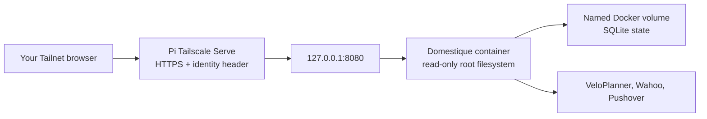

# Raspberry Pi deployment

Domestique runs as one private Docker container on a Raspberry Pi already in
the Tailnet. This guide deliberately keeps the compose file, static
configuration, Docker secrets, and image digest on the Pi, outside this
repository.

## Trust boundary



The container never exposes a LAN or Internet port. Tailscale Serve terminates
HTTPS and forwards to the container over loopback; `cloudflared` reaches Serve
by Tailscale Service name. The application accepts one identity, a Cloudflare
Access assertion it verifies itself, and reads no identity header. Keep Docker's
host publication loopback-only: it is what keeps the listener reachable only
through Serve.

Do not use Tailscale Funnel for this service. Wahoo does not connect to the Pi:
the browser follows Wahoo's authorization redirect back to the Tailnet URL
after the user signs in.

## Prepare deployment state

On the Pi, create a directory owned by the operator, for example
`/srv/domestique`. Copy [`config.example.toml`](../config.example.toml) there as
`config.toml`, replacing all placeholders. The exact
`wahoo.redirect_url` must be the HTTPS URL served by this Pi and end in
`/oauth/wahoo/callback`.

Create these six files in `/srv/domestique/secrets`, each containing exactly
one value:

- `state_encryption_key` — base64url encoding of 32 random bytes;
- `veloplanner_email` and `veloplanner_password`;
- `wahoo_client_secret`;
- `pushover_application_token`; and
- `pushover_user_key`.

The static TOML contains only their in-container paths under `/run/secrets`.
Docker Compose mounts the values as read-only Docker secrets. It is equally
valid to provision those files manually or with a separate tool such as fnox;
the service has no dependency on that tool.

Keep the state encryption key and `domestique-state` volume. Losing either
requires Wahoo reauthorization and safe route adoption; there is intentionally
no state backup or key-rotation workflow in v1.

## Verify and select an image

Each tag release names an immutable `ghcr.io/nobbs/domestique@sha256:...`
image. Record that complete digest in `/srv/domestique/.env` as
`DOMESTIQUE_IMAGE`. Never use a mutable tag such as `latest`.

Before deployment, pull the digest and verify the keyless signature:

```sh
docker pull "$DOMESTIQUE_IMAGE"
cosign verify \
  --certificate-identity-regexp '^https://github\.com/nobbs/domestique/\.github/workflows/release\.yml@refs/tags/v.*$' \
  --certificate-oidc-issuer 'https://token.actions.githubusercontent.com' \
  "$DOMESTIQUE_IMAGE"
```

The Pi needs read access to the private GHCR package to pull it. Grant the
smallest appropriate package-read credential to Docker; it is deployment
infrastructure, not an application secret. The release image also carries
BuildKit-generated SBOM and provenance attestations. Inspect them before a
release when investigating supply-chain changes.

## Run the container

Copy [`compose.example.yml`](compose.example.yml) to
`/srv/domestique/compose.yml`, then start it from that directory:

```sh
docker compose --env-file .env -f compose.yml up -d
curl --fail http://127.0.0.1:8080/healthz
```

The named volume is initialized from the image with the unprivileged runtime
ownership. If replacing it with a host bind mount, make the target writable by
UID and GID `65532` first. Do not remove or recreate the volume during routine
updates.

Configure the host proxy once the local probe succeeds:

```sh
tailscale serve --bg 8080
tailscale serve status
```

Tailscale Serve prints the private HTTPS URL. Put that exact URL plus
`/oauth/wahoo/callback` into both `wahoo.redirect_url` and the Wahoo app's
registered callback configuration. Ensure the Tailnet ACL permits only the
configured user to reach the Pi. The Serve setting survives reboots when set
with `--bg`.

Open the Serve URL in the configured user's browser, then authorize each fixed
target slot from `/oauth/wahoo/start/<target-id>`. Check `/v1/status` after
each authorization. The delayed first sync and hourly schedule start with the
container; a Pushover message reports every completed sync, including success.

## Update and rollback

For an update, verify the new signed digest, replace only
`DOMESTIQUE_IMAGE` in `/srv/domestique/.env`, and run `docker compose up -d`.
The container leaves the named state volume in place. Rollback is the same
operation with an earlier verified digest; it never restores old SQLite state.

Do not run `docker compose down -v`, which deletes the state volume.
