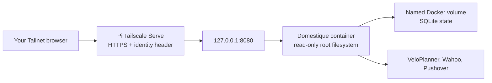

# Raspberry Pi deployment

Domestique runs as one private Docker container on a Raspberry Pi already in
the Tailnet. This guide deliberately keeps the compose file, static
configuration, Docker secrets, and image digest on the Pi, outside this
repository.

## Trust boundary



The container never exposes a LAN or Internet port. Tailscale Serve terminates
HTTPS and forwards to the container over loopback; `cloudflared` reaches Serve
by Tailscale Service name. The application accepts one identity, a Cloudflare
Access assertion it verifies itself, and reads no identity header. Keep Docker's
host publication loopback-only: it is what keeps the listener reachable only
through Serve.

Do not use Tailscale Funnel for this service. Wahoo does not connect to the Pi:
the browser follows Wahoo's authorization redirect back to the Tailnet URL
after the user signs in.

## Prepare deployment state

On the Pi, create a directory owned by the operator, for example
`/srv/domestique`. Copy [`config.example.toml`](../config.example.toml) there as
`config.toml`, replacing all placeholders. The exact
`wahoo.redirect_url` must be the HTTPS URL served by this Pi and end in
`/oauth/wahoo/callback`.

Create these six files in `/srv/domestique/secrets`, each containing exactly
one value:

- `state_encryption_key` — base64url encoding of 32 random bytes;
- `veloplanner_email` and `veloplanner_password`;
- `wahoo_client_secret`;
- `pushover_application_token`; and
- `pushover_user_key`.

The static TOML contains only their in-container paths under `/run/secrets`.
Docker Compose mounts the values as read-only Docker secrets. It is equally
valid to provision those files manually or with a separate tool such as fnox;
the service has no dependency on that tool.

Keep the state encryption key and `domestique-state` volume. Losing either
requires Wahoo reauthorization and safe route adoption; there is intentionally
no state backup or key-rotation workflow in v1.

## Select an image

A default-branch change that touches an input of the image publishes an image
index to `ghcr.io/nobbs/domestique`; one that touches none publishes nothing, so
not every commit on the branch has an image of its own. The publishing run's
summary prints the exact immutable reference; record that complete digest in
`/srv/domestique/.env` as `DOMESTIQUE_IMAGE`. Never use a mutable tag such as
`latest`.

The compose file also passes `DOMESTIQUE_IMAGE` into the container, so the
running service can report which image it is on its status page beside the commit
it was built from. Only the digest is read from it; the registry and repository
stay on the host. Nothing breaks without it — the service then names the commit
alone.

The package is private, so the Pi needs a package-read credential. The container
registry accepts only a personal access token (classic); create one whose sole
scope is `read:packages`, then:

```sh
read -rs GHCR_TOKEN
printf '%s' "$GHCR_TOKEN" | docker login ghcr.io -u nobbs --password-stdin
unset GHCR_TOKEN
```

That credential is deployment infrastructure, not an application secret, and it
is stored base64-encoded in `~/.docker/config.json`, which must not be readable
by anyone else. Nothing else on the Pi needs a registry credential: it pulls
rather than builds, so it needs no `dhi.io` login.

Resolve and pin the digest from the **index**, not from a pulled
per-architecture manifest, so the same `.env` would work on either
architecture:

```sh
IMAGE=ghcr.io/nobbs/domestique
DIGEST=$(docker buildx imagetools inspect "$IMAGE:sha-<short-commit>" \
  --format '{{.Manifest.Digest}}')
docker pull "$IMAGE@$DIGEST"
docker image inspect "$IMAGE@$DIGEST" --format '{{.Os}}/{{.Architecture}}'
```

The image is not signed, so there is no signature to check: what makes a digest
trustworthy is that it came from the run that built it on the default branch of
the private repository. Do not accept a digest from any other source. The image
does carry BuildKit-generated SBOM and provenance attestations, which are worth
inspecting when investigating a supply-chain change:

```sh
docker buildx imagetools inspect "$IMAGE@$DIGEST" --format '{{ json .Provenance }}'
docker buildx imagetools inspect "$IMAGE@$DIGEST" --format '{{ json .SBOM }}'
```

## Run the container

Copy [`compose.example.yml`](compose.example.yml) to
`/srv/domestique/compose.yml`, then start it from that directory:

```sh
docker compose --env-file .env -f compose.yml up -d
curl --fail http://127.0.0.1:8080/healthz
curl --fail http://127.0.0.1:8081/readyz
```

The two probes answer different questions. `/healthz`, on the served port, says
the process is answering HTTP. `/readyz`, on its own loopback port, says it can
read the state it was configured with — it makes no call to VeloPlanner, Wahoo,
Pushover, Cloudflare, Tailscale, or the tile provider, and it stays ready while
a target still waits for its one-time authorisation. Only the served port is
given to `tailscale serve`, so readiness never becomes an endpoint on the
authenticated public surface.

The named volume is initialized from the image with the unprivileged runtime
ownership. If replacing it with a host bind mount, make the target writable by
UID and GID `65532` first. Do not remove or recreate the volume during routine
updates.

Configure the host proxy once the local probe succeeds. Serve publishes a
Tailscale Service name rather than the node's own name, so the address the
tunnel dials keeps working if the app ever moves hosts:

```sh
tailscale serve --service=svc:domestique --https=443 127.0.0.1:8080
tailscale serve advertise svc:domestique
tailscale serve status
```

A `--service` serve defaults to `--bg`, so it runs in the background and
survives reboots without the flag. Advertising is the separate step that makes
this node a host for the Service; until it runs, the Service name does not
resolve. Serve is in the path even though nothing reaches Domestique over the
Tailnet directly: it is what strips a client-supplied `Tailscale-User-Login`
before the handler sees it. See
[`cloudflare-access.md`](cloudflare-access.md) for the tunnel and the grant that
lets exactly one tagged node dial this Service.

Requests are authenticated by Cloudflare Access, so browser work happens at the
public hostname, not at the Serve URL — the Serve URL carries no Access
assertion and answers `401`. Put that public hostname plus
`/oauth/wahoo/callback` into both `wahoo.redirect_url` and the Wahoo app's
registered callback configuration: the OAuth flow returns to an ordinary
browser, which may not be on the Tailnet at all.

Open the public URL in the configured user's browser, then authorize each fixed
target slot from `/oauth/wahoo/start/<target-id>`. Check `/v1/status` after
each authorization. The delayed first sync and hourly schedule start with the
container; a Pushover message reports every completed sync, including success.

## Update and rollback

This host is updated by hand. The Linux VM described in
[the Hetzner guide](hetzner.md#deploy-from-ci) is deployed automatically by CI
instead; a Pi that wanted the same could install the same script.

For an update, take the digest from the run that published it, replace only
`DOMESTIQUE_IMAGE` in `/srv/domestique/.env`, and run `docker compose up -d`.
The container leaves the named state volume in place. Rollback is the same
operation with an earlier published digest; it never restores old SQLite state.

Do not run `docker compose down -v`, which deletes the state volume.
