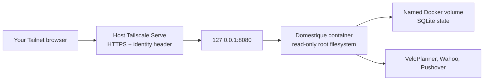

# Linux VM deployment

Domestique runs as one Docker container on a small always-on Linux VM in the
Tailnet, and **pulls a published image by digest**. GitHub Actions publishes
the image from the default branch, so this host never builds one.

Building here was the earlier arrangement, and it is where this VM's memory
pressure came from: a two-platform `pnpm install` and Go build does not fit
alongside the running service on two vCPUs and 4 GB. A host that only pulls
carries none of that load and needs no `dhi.io` credential.

The compose file, configuration, secret files, and pinned digest stay on the
host, outside this repository.

## Trust boundary



This boundary is the reason the listener stays private at all. On a VM with a
public IP it deserves extra care: the container must publish to `127.0.0.1`
only, never to `0.0.0.0`.
Confirm it after every start with `ss -tlnp`. Do not use Tailscale Funnel, and
do not put a general-purpose reverse proxy in front of the service. The
application authenticates every request by verifying a Cloudflare Access
assertion, so a proxy cannot hand over the API by forwarding a header — but it
can still expose an unauthenticated listener to the Internet.

Reaching the service from outside the Tailnet has one supported form, described
in [the Cloudflare Access guide](cloudflare-access.md). It satisfies the rule
above rather than bending it: the proxy's origin is the Tailscale Service name,
so Tailscale Serve stays in the path and strips the client-supplied header, and
the application independently verifies a signed Cloudflare Access assertion. Any
other proxy, or that same proxy pointed at `127.0.0.1`, hands over the API.

Wahoo never connects to this host. The browser follows Wahoo's authorisation
redirect back to the callback URL after the user signs in, so the OAuth flow
needs no inbound path of its own.

## Prepare the host

Install Docker Engine with the Compose plugin from Docker's own apt repository,
and Tailscale from its apt repository. Then join the Tailnet with the tag that
your policy allows to host the service:

```sh
tailscale up --advertise-tags=tag:<service-tag>
```

Tag assignment needs an auth key or an interactive login, and the tag must
appear in the Tailnet policy's `tagOwners`. Verify with `tailscale status --json`
that the node carries the tag before continuing.

## Prepare deployment state

Create a directory owned by the operator, for example `/srv/domestique`:

```text
/srv/domestique/
├── compose.yml   # docs/compose.example.yml, unmodified
├── .env          # DOMESTIQUE_IMAGE=ghcr.io/nobbs/domestique@sha256:<digest>
├── config.toml   # config.example.toml with every placeholder replaced
├── secrets/      # the six secret files
└── src/          # optional checkout, for development against real data
```

Copy [`config.example.toml`](../config.example.toml) to `config.toml` and
replace all placeholders. `wahoo.redirect_url` must be the HTTPS URL this host
serves and must end in `/oauth/wahoo/callback`.

Create the six files in `secrets/`, each containing exactly one value:
`state_encryption_key` (base64url of 32 random bytes), `veloplanner_email`,
`veloplanner_password`, `wahoo_client_secret`, `pushover_application_token`,
and `pushover_user_key`.

**File ownership matters on Linux.** Compose bind-mounts each secret into the
container, where the unprivileged runtime user reads it directly, so the files
must be readable by UID `65532`. Docker Desktop hides this on macOS; a Linux
host does not:

```sh
chown 65532:65532 secrets/*
chmod 0400 secrets/*
chmod 0444 config.toml
```

Keep the state encryption key together with the `domestique-state` volume.
Losing either requires Wahoo reauthorisation and safe route adoption; there is
intentionally no state backup or key-rotation workflow.

## Pull a published image

Every default-branch change that touches an input of the image publishes one
`linux/amd64` image to `ghcr.io/nobbs/domestique`. The package is private,
so the host needs a **classic** personal access token scoped to `read:packages`
— a fine-grained token cannot authenticate to ghcr.io:

```sh
read -rs GHCR_TOKEN
printf '%s' "$GHCR_TOKEN" | docker login ghcr.io -u <github-user> --password-stdin
unset GHCR_TOKEN
chmod 600 ~/.docker/config.json
```

Take the short commit from the run that published the image, and resolve the
**index** digest:

```sh
docker buildx imagetools inspect ghcr.io/nobbs/domestique:sha-<short-commit> \
  --format '{{.Manifest.Digest}}'
```

Confirm it matches the digest that run reported in its summary, then write the
value into `.env`, replacing any earlier one:

```text
DOMESTIQUE_IMAGE=ghcr.io/nobbs/domestique@sha256:<digest>
```

The compose file also passes `DOMESTIQUE_IMAGE` into the container, so the
running service can report which image it is on its status page beside the
commit it was built from. Only the digest is read from it; the registry and
repository stay on the host. Nothing breaks without it — the service then names
the commit alone.

Pin that index digest — not the manifest digest under it, and not a tag. The
push is an index even though it covers one architecture, because the bill of
materials and the provenance travel beside the image as their own manifests, and
reading a digest out of `docker images --digests` after a pull can hand you the
image manifest alone, which leaves those behind. `latest` moves, so it names an
image to look at, never one to deploy.

The image is not signed, so there is no signature to check: what makes a digest
trustworthy is that it came from the run that built it on the default branch of
the private repository. Do not accept a digest from any other source.
[The delivery specification](specs/delivery.md) states why nothing is signed and
what stands in its place. The image does carry BuildKit-generated SBOM and
provenance attestations, which are worth inspecting when investigating a
supply-chain change:

```sh
IMAGE=ghcr.io/nobbs/domestique@sha256:<digest>
docker buildx imagetools inspect "$IMAGE" --format '{{ json .Provenance }}'
docker buildx imagetools inspect "$IMAGE" --format '{{ json .SBOM }}'
```

## Run the container

Copy [`compose.example.yml`](compose.example.yml) to `compose.yml`, then start
it from the deployment directory:

```sh
docker compose --env-file .env up -d
curl --fail http://127.0.0.1:8080/healthz
curl --fail http://127.0.0.1:8081/readyz
ss -tlnp | grep -E '8080|8081'
```

The readiness probe is the second port, published to loopback like the first and
deliberately never given to `tailscale serve`: it says the service can read the
state it was configured with, while `/healthz` says only that the process
answers HTTP. Readiness contacts nothing outside this host, and a target still
waiting for its one-time authorisation does not make it unready.

The last command must show `127.0.0.1:8080` and `127.0.0.1:8081`, and nothing
bound to a public address. The named state volume is initialised from the image
with the unprivileged runtime ownership; replacing it with a host bind mount
means making the target writable by UID and GID `65532` first. Do not remove or
recreate it during a routine update. The service writes no log line on a healthy
start — it logs only errors — so a running container with no restarts and a
passing health probe is the expected quiet result.

`compose.yml` also sets `stop_grace_period`, which has to stay longer than the
shutdown budget in `cmd/domestique/main.go`: Docker's default of ten seconds is
shorter than that budget and kills the container part-way through a drain. A
host set up before this line existed still has the older file — a deploy
replaces the image and never the compose file — so copy the current
`compose.example.yml` over it, or add the one line, and recreate the service
once with `docker compose --env-file .env up -d`.

## Publish it through Tailscale

Configure the host as the proxy for the managed Tailnet Service:

```sh
tailscale serve --service=svc:<service> --https=443 127.0.0.1:8080
tailscale serve advertise svc:<service>
tailscale serve status
```

A **new** host advertising an existing service needs admin approval before the
service name resolves. Until it is approved, `tailscale serve status` shows the
configuration but the Tailnet DNS name does not resolve and `Self.Services`
stays empty in `tailscale status --json`. Approve the host for the service in
the admin console, then re-check.

Put the exact served URL plus `/oauth/wahoo/callback` into both
`wahoo.redirect_url` and the Wahoo application's registered callback. Ensure
the Tailnet policy permits only the configured user to reach the host.

Open the service URL in the configured user's browser, then authorise each fixed
target slot from `/oauth/wahoo/start/<target-id>` and check `/v1/status` after
each one. A tagged device is not a member identity and cannot complete the
protected OAuth flow.

## Move an existing deployment to this host

Keeping the same Tailnet service name means the served URL, and therefore
`wahoo.redirect_url`, does not change, so no Wahoo slot needs reauthorising if
the state and its key travel together.

1. Stop the container on the old host with `docker compose down` — **never**
   `-v`. A clean stop checkpoints the SQLite WAL into the database file.
2. Stream the state volume to the new host, and copy `config.toml` and the six
   secret files across:

   ```sh
   docker run --rm -v <project>_domestique-state:/s:ro alpine tar -cf - -C /s . \
     | ssh <host> 'docker run --rm -i -v <project>_domestique-state:/s alpine \
         sh -c "tar -xf - -C /s && chown -R 65532:65532 /s"'
   ```

3. Apply the ownership rules above to the copied secrets, then start the
   container and confirm `/v1/status` reports every target as `authorized`.
   That is the proof the encryption key and database arrived intact; a target
   that reports otherwise means the key and the database no longer match, and
   the run should be stopped rather than left to reconcile against half the
   state.
4. Withdraw the service from the old host with `tailscale serve drain` followed
   by `tailscale serve clear`, then advertise it here. Only one host should
   advertise the service, because two would run the sync loop against the same
   Wahoo accounts.

Leave the old host's volume in place until the new host has completed a sync;
it is the rollback path.

## Deploy from CI

Merging to the default branch moves this host onto the image that merge
published. The `deploy` job joins the tailnet as an ephemeral `tag:github` node
— authenticated by workload identity federation, so no tailnet credential is
stored in GitHub — and runs one command over Tailscale SSH:

```sh
sudo /usr/local/lib/domestique/domestique-deploy.sh sha256:<digest>
```

That script is [`deploy/domestique-deploy.sh`](../deploy/domestique-deploy.sh)
in this repository. It pulls the digest, records the one being replaced, pins
the new one in `.env`, restarts only the `domestique` service, and waits for
`/healthz` and then `/readyz`. If the new image does not answer within a minute,
cannot read its state, or publishes anything other than a loopback port, the
script restores the previous digest,
restarts, and sends a Pushover alert; the CI job fails either way. Nothing in
any path removes the state volume.

**The digest is the only thing CI supplies.** The image reference is composed on
the host from its own configured repository, so the workflow cannot point this
host at another registry, another repository, or a mutable tag — `latest` is
still never deployed. The account CI logs in as is unprivileged, is not in the
`docker` group, and may run exactly this one command as root.

Prepare the host once:

```sh
useradd --create-home --shell /bin/bash domestique-deploy
install -D -o root -g root -m 0755 deploy/domestique-deploy.sh \
  /usr/local/lib/domestique/domestique-deploy.sh
printf '%s\n' \
  'domestique-deploy ALL=(root) NOPASSWD: /usr/local/lib/domestique/domestique-deploy.sh' \
  > /etc/sudoers.d/domestique-deploy
chmod 0440 /etc/sudoers.d/domestique-deploy && visudo -c
mkdir -p /var/lib/domestique-deploy
chmod 600 .env   # it carries the tunnel's Tailscale auth key
tailscale set --ssh
```

The script must stay owned by root and unwritable by `domestique-deploy`.
Otherwise that account could rewrite what its own sudoers entry runs as root,
and the boundary the previous paragraph describes would not exist. Reinstall it
with the same `install` command whenever the repository copy changes; nothing
updates it automatically.

The tailnet side lives in the `nobbs/infrastructure` repository, in
`stacks/tailscale`: policy rules letting `tag:github` reach `tag:domestique` on
port 22 and log in over Tailscale SSH as `domestique-deploy`, and the federated
identity the workflow authenticates as, declared as `domestique_deploy` in
`terraform.tfvars`. That identity may do one thing, mint an ephemeral
`tag:github` node, and the stack's `federated_identities` output carries the
client ID and audience to set here.

GitHub needs a `production` environment and four repository variables, none of
them secret: `TS_DEPLOY_CLIENT_ID` and `TS_DEPLOY_AUDIENCE` from that output,
`DOMESTIQUE_HOST` for this host's fully-qualified MagicDNS name, and
`DOMESTIQUE_DEPLOY_USER`. The environment is not only a deployment log: because
the `deploy` job names it, the job's OIDC subject becomes

```text
repo:nobbs@203061/domestique@1336140013:environment:production
```

which is exactly what the federated identity matches on. Renaming or removing
the environment stops the deploy from authenticating at all. The numeric owner
and repository IDs are GitHub's immutable subject format, the default for
repositories created after 2026-07-15; the identity has to be updated with the
current prefix if this repository is ever transferred:

```sh
gh api repos/nobbs/domestique/actions/oidc/customization/sub --jq .sub_claim_prefix
```

## Update and rollback

Routine updates are the merge described above; what follows is the manual path,
for a rollback or for a host CI cannot reach. The
[operator recovery runbook](runbook.md) covers the other interventions this host
occasionally needs, and what each one is safe to assume.

The script is the same one CI runs, and it is the shortest way to move back:

```sh
sudo /usr/local/lib/domestique/domestique-deploy.sh --rollback
```

That returns the host to the digest it ran before the last change, which the
script keeps in `/var/lib/domestique-deploy/previous`;
`/var/lib/domestique-deploy/history` holds every digest this host has run, with
timestamps. Passing an explicit `sha256:` digest instead goes to any published
image. Neither restores old SQLite state.

Without the script — on a host that has none, or when the script itself is what
broke — resolve the digest of a published image as above, point
`DOMESTIQUE_IMAGE` at it, and run `docker compose --env-file .env up -d`. The
named state volume stays in place.

Keep the previous digest written down. A digest stays pullable after its tag has
moved on, so the rollback path survives even once the local copy is gone — but
only if the value was recorded somewhere.

A host that used to build has disk to reclaim. The deploy script prunes
published images other than the running and the rollback digest, but it knows
nothing about locally built ones: remove the stale `domestique:<git-sha>` images
with `docker image rm`, then run `docker builder prune -af` to clear the BuildKit
cache those builds accumulated. Leave the `alpine` image in place; the migration
recipe above uses it. Never run `docker system prune --volumes`.

Do not run `docker compose down -v`, which deletes the state volume.
