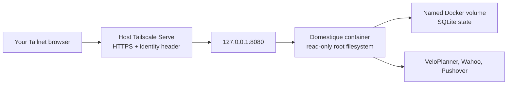

# Linux VM deployment

Domestique runs as one Docker container on a small always-on Linux VM in the
Tailnet. This guide covers a host that **builds the image from a checkout**,
which is the same runtime contract as the [Pi deployment](deployment.md) but
without a release artifact: a locally built image carries no signature and no
provenance, so it is a deployment convenience, not a verified artifact. Prefer
[the Pi guide](deployment.md) once a tagged release exists for the host
architecture.

The compose file, configuration, secret files, and image tag stay on the host,
outside this repository.

## Trust boundary



This is the same boundary the other host guides describe, and it is the reason
the listener stays private at all. On a VM with a public IP it deserves extra
care: the container must publish to `127.0.0.1` only, never to `0.0.0.0`.
Confirm it after every start with `ss -tlnp`. Do not use Tailscale Funnel, and
do not put a general-purpose reverse proxy in front of the service. The
application authenticates every request by verifying a Cloudflare Access
assertion, so a proxy cannot hand over the API by forwarding a header — but it
can still expose an unauthenticated listener to the Internet.

Reaching the service from outside the Tailnet has one supported form, described
in [the Cloudflare Access guide](cloudflare-access.md). It satisfies the rule
above rather than bending it: the proxy's origin is the Tailscale Service name,
so Tailscale Serve stays in the path and strips the client-supplied header, and
the application independently verifies a signed Cloudflare Access assertion. Any
other proxy, or that same proxy pointed at `127.0.0.1`, hands over the API.

## Prepare the host

Install Docker Engine with the Compose plugin from Docker's own apt repository,
and Tailscale from its apt repository. Then join the Tailnet with the tag that
your policy allows to host the service:

```sh
tailscale up --advertise-tags=tag:<service-tag>
```

Tag assignment needs an auth key or an interactive login, and the tag must
appear in the Tailnet policy's `tagOwners`. Verify with `tailscale status --json`
that the node carries the tag before continuing.

## Prepare deployment state

Create a directory owned by the operator, for example `/srv/domestique`:

```text
/srv/domestique/
├── compose.yml   # docs/compose.example.yml, unmodified
├── .env          # DOMESTIQUE_IMAGE=domestique:<git-sha>
├── config.toml   # config.example.toml with every placeholder replaced
├── secrets/      # the six secret files
└── src/          # the checkout the image is built from
```

Copy [`config.example.toml`](../config.example.toml) to `config.toml` and
replace all placeholders. `wahoo.redirect_url` must be the HTTPS URL this host
serves and must end in `/oauth/wahoo/callback`.

Create the six files in `secrets/`, each containing exactly one value:
`state_encryption_key` (base64url of 32 random bytes), `veloplanner_email`,
`veloplanner_password`, `wahoo_client_secret`, `pushover_application_token`,
and `pushover_user_key`.

**File ownership matters on Linux.** Compose bind-mounts each secret into the
container, where the unprivileged runtime user reads it directly, so the files
must be readable by UID `65532`. Docker Desktop hides this on macOS; a Linux
host does not:

```sh
chown 65532:65532 secrets/*
chmod 0400 secrets/*
chmod 0444 config.toml
```

Keep the state encryption key together with the `domestique-state` volume.
Losing either requires Wahoo reauthorisation and safe route adoption; there is
intentionally no state backup or key-rotation workflow in v1.

## Build the image

The base images are Docker Hardened Images, so the host needs `docker login
dhi.io` with a Docker Hub account and personal access token, including on the
free Community tier. Clone the repository into `src/`, then:

```sh
docker build -t "domestique:$(git -C src rev-parse --short HEAD)" src
```

Record that tag in `.env` as `DOMESTIQUE_IMAGE`. Tagging by commit is what makes
a rollback possible: the previous tag stays in the local image store, so
reverting is an edit to `.env` and a restart. The Dockerfile cross-compiles from
the build platform, so amd64 and arm64 hosts both build natively without
emulation.

## Run the container

Copy [`compose.example.yml`](compose.example.yml) to `compose.yml`, then start
it from the deployment directory:

```sh
docker compose --env-file .env up -d
curl --fail http://127.0.0.1:8080/healthz
ss -tlnp | grep 8080
```

The last command must show `127.0.0.1:8080` and nothing bound to a public
address. The service writes no log line on a healthy start — it logs only
errors — so a running container with no restarts and a passing health probe is
the expected quiet result.

## Publish it through Tailscale

Configure the host as the proxy for the managed Tailnet Service:

```sh
tailscale serve --service=svc:<service> --https=443 127.0.0.1:8080
tailscale serve --service=svc:<service> --http=8080 127.0.0.1:8080
tailscale serve status
```

A **new** host advertising an existing service needs admin approval before the
service name resolves. Until it is approved, `tailscale serve status` shows the
configuration but the Tailnet DNS name does not resolve and `Self.Services`
stays empty in `tailscale status --json`. Approve the host for the service in
the admin console, then re-check.

Put the exact served URL plus `/oauth/wahoo/callback` into both
`wahoo.redirect_url` and the Wahoo application's registered callback. Ensure
the Tailnet policy permits only the configured user to reach the host.

Open the service URL in the configured user's browser, then authorise each fixed
target slot from `/oauth/wahoo/start/<target-id>` and check `/v1/status` after
each one. A tagged device is not a member identity and cannot complete the
protected OAuth flow.

## Move an existing deployment to this host

Keeping the same Tailnet service name means the served URL, and therefore
`wahoo.redirect_url`, does not change, so no Wahoo slot needs reauthorising if
the state and its key travel together.

1. Stop the container on the old host with `docker compose down` — **never**
   `-v`. A clean stop checkpoints the SQLite WAL into the database file.
2. Stream the state volume to the new host, and copy `config.toml` and the six
   secret files across:

   ```sh
   docker run --rm -v <project>_domestique-state:/s:ro alpine tar -cf - -C /s . \
     | ssh <host> 'docker run --rm -i -v <project>_domestique-state:/s alpine \
         sh -c "tar -xf - -C /s && chown -R 65532:65532 /s"'
   ```

3. Apply the ownership rules above to the copied secrets, then start the
   container and confirm `/v1/status` reports every target as `authorized`.
   That is the proof the encryption key and database arrived intact; a target
   that reports otherwise means the key and the database no longer match, and
   the run should be stopped rather than left to reconcile against half the
   state.
4. Withdraw the service from the old host with `tailscale serve drain` followed
   by `tailscale serve clear`, then advertise it here. Only one host should
   advertise the service, because two would run the sync loop against the same
   Wahoo accounts.

Leave the old host's volume in place until the new host has completed a sync;
it is the rollback path.

## Update and rollback

To update, pull the checkout, rebuild, point `DOMESTIQUE_IMAGE` at the new tag,
and run `docker compose up -d`. The named state volume stays in place. Rollback
is the same operation with the previous tag; it never restores old SQLite state.

Do not run `docker compose down -v`, which deletes the state volume.
