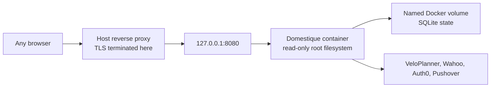

# Linux VM deployment

Domestique runs as one Docker container on a small always-on Linux VM in the
Tailnet, and **pulls a published image by digest**. GitHub Actions publishes
the image from the default branch, so this host never builds one.

This host does not build. A two-platform `pnpm install` and Go build does not
fit alongside the running service on two vCPUs and 4 GB, and a host that only
pulls needs no `dhi.io` credential.

The compose file, configuration, secret files, and pinned digest stay on the
host, outside this repository.

## Trust boundary



On a VM with a public IP, the container must publish to `127.0.0.1` only, never
to `0.0.0.0`. Confirm it after every start with `ss -tlnp`.

Reaching the service is a supported, TLS-terminating reverse proxy in front of
it — [the Auth0 guide](auth0.md) documents a Caddy example. The proxy forwards
only to `127.0.0.1:8080`, never to the readiness listener, and never adds or
trusts an identity header of its own: the service reads no identity header at
all, and authenticates every request by verifying a session it issued itself
from an ID token it validated against the configured Auth0 tenant. A proxy
therefore cannot hand over the API by forwarding a header, but a proxy pointed
at an unintended port, or a second unproxied listener, can still expose one.

Wahoo never connects to this host. The browser follows Wahoo's authorisation
redirect back to the callback URL after the user signs in, so the OAuth flow
needs no inbound path of its own.

## Prepare the host

Install Docker Engine with the Compose plugin from Docker's own apt repository,
and Tailscale from its apt repository. Then join the Tailnet with the tag that
your policy allows to host the service:

```sh
tailscale up --advertise-tags=tag:<service-tag>
```

Tag assignment needs an auth key or an interactive login, and the tag must
appear in the Tailnet policy's `tagOwners`. Verify with `tailscale status --json`
that the node carries the tag before continuing.

## Prepare deployment state

Create a directory owned by the operator, for example `/srv/domestique`:

```text
/srv/domestique/
├── compose.yml   # docs/compose.example.yml, unmodified
├── .env          # DOMESTIQUE_IMAGE=ghcr.io/nobbs/domestique@sha256:<digest>
├── config.toml   # config.example.toml with every placeholder replaced
├── secrets/      # the state key, the Auth0 client secret, and the deploy
│                 # script's own Pushover pair
└── src/          # optional checkout, for development against real data
```

Copy [`config.example.toml`](../config.example.toml) to `config.toml` and
replace all placeholders. `http.browser_origin_url` must be the HTTPS URL this
host serves, with no path.

Create `secrets/state_encryption_key`, containing base64url of 32 random bytes,
and `secrets/auth0_client_secret`, holding the Auth0 application's client
secret. Those are the only two secrets the service reads from the host: every
other credential it reaches an upstream with is entered on its settings page
after it is running, and stored encrypted under the state key.

Add `secrets/pushover_application_token` and `secrets/pushover_user_key` too if
this host should alert on a failed deployment. Those two are the deploy
script's own: it reports a service that never started, which is when it cannot
read the service's database.

**File ownership matters on Linux.** Compose bind-mounts each secret into the
container, where the unprivileged runtime user reads it directly, so the files
must be readable by UID `65532`. Docker Desktop hides this on macOS; a Linux
host does not:

```sh
chown 65532:65532 secrets/*
chmod 0400 secrets/*
chmod 0444 config.toml
```

Keep the state encryption key together with the `domestique-state` volume.
Losing either requires Wahoo reauthorisation and safe route adoption; there is
no state backup or key-rotation workflow.

## Pull a published image

Every default-branch change that touches an input of the image publishes one
`linux/amd64` image to `ghcr.io/nobbs/domestique`. The package is private,
so the host needs a **classic** personal access token scoped to `read:packages`;
a fine-grained token cannot authenticate to ghcr.io:

```sh
read -rs GHCR_TOKEN
printf '%s' "$GHCR_TOKEN" | docker login ghcr.io -u <github-user> --password-stdin
unset GHCR_TOKEN
chmod 600 ~/.docker/config.json
```

Take the short commit from the run that published the image, and resolve the
**index** digest:

```sh
docker buildx imagetools inspect ghcr.io/nobbs/domestique:sha-<short-commit> \
  --format '{{.Manifest.Digest}}'
```

Confirm it matches the digest that run reported in its summary, then write the
value into `.env`, replacing any earlier one:

```text
DOMESTIQUE_IMAGE=ghcr.io/nobbs/domestique@sha256:<digest>
```

The compose file also passes `DOMESTIQUE_IMAGE` into the container, so the
running service can report which image it is on its status page beside the
commit it was built from. Only the digest is read from it; the registry and
repository stay on the host. Nothing breaks without it; the service then names
the commit alone.

Pin that index digest, not the manifest digest under it and not a tag. The push
is an index even though it covers one architecture: the bill of materials and
the provenance travel beside the image as their own manifests. Reading a digest
out of `docker images --digests` after a pull can hand you the image manifest
alone, which leaves those behind. `latest` moves, so it names an image to look
at, never one to deploy.

The image is not signed, so there is no signature to check. What makes a digest
trustworthy is that it came from the run that built it on the default branch of
the private repository. Do not accept a digest from any other source.
[The delivery specification](specs/delivery.md) states what stands in place of a
signature. The image does carry BuildKit-generated SBOM and provenance
attestations, which are worth inspecting when investigating a supply-chain
change:

```sh
IMAGE=ghcr.io/nobbs/domestique@sha256:<digest>
docker buildx imagetools inspect "$IMAGE" --format '{{ json .Provenance }}'
docker buildx imagetools inspect "$IMAGE" --format '{{ json .SBOM }}'
```

## Run the container

Copy [`compose.example.yml`](compose.example.yml) to `compose.yml`, then start
it from the deployment directory:

```sh
docker compose --env-file .env up -d
curl --fail http://127.0.0.1:8080/healthz
curl --fail http://127.0.0.1:8081/readyz
ss -tlnp | grep -E '8080|8081'
```

The readiness probe is the second port, published to loopback like the first and
never given to the reverse proxy. It reports that the service can read the state
it was configured with, while `/healthz` reports only that the process answers
HTTP. Readiness contacts nothing outside this host, and a target still waiting
for its one-time authorisation does not make it unready.

The last command must show `127.0.0.1:8080` and `127.0.0.1:8081`, and nothing
bound to a public address. The named state volume is initialised from the image
with the unprivileged runtime ownership; replacing it with a host bind mount
means making the target writable by UID and GID `65532` first. Do not remove or
recreate it during a routine update. The service writes no log line on a healthy
start — it logs only errors — so a running container with no restarts and a
passing health probe is the expected quiet result.

`compose.yml` also sets `stop_grace_period`, which has to stay longer than the
shutdown budget in `cmd/domestique/main.go`. Docker's default of ten seconds is
shorter than that budget and kills the container part-way through a drain. A
deploy replaces the image and never the compose file, so a host carrying an
older `compose.yml` needs the current `compose.example.yml` copied over it, or
the one line added, and the service recreated once with
`docker compose --env-file .env up -d`.

## Publish it through the reverse proxy

Deploy a TLS-terminating reverse proxy on the host, forwarding only to
`127.0.0.1:8080` and never to the readiness listener — [the Auth0
guide](auth0.md) documents a Caddy example. Point DNS for the public hostname
at this host.

Put that hostname into `http.browser_origin_url`, and the URLs it derives —
that hostname plus `/oauth/wahoo/callback`, and plus `/auth/callback` — into
the Wahoo application's registered callback and the Auth0 application's
Allowed Callback URLs respectively. Open the host firewall to the reverse
proxy's port only.

Open the service URL in a browser and complete first-time sign-in as [the
Auth0 guide](auth0.md) describes. A host reaching this point has a running
service that is not configured yet: fill in the source libraries and their
accounts, the Wahoo application and its client secret, and the target slots on
the settings page, which names what is still missing. Then authorise each slot
from `/oauth/wahoo/start/<target-id>` and check `/v1/status` after each one.

## Move an existing deployment to this host

Keeping the same public hostname means `http.browser_origin_url` does not
change, so no Wahoo slot needs reauthorising if the state and its key travel
together. The settings travel with the state, so nothing is retyped either.

1. Stop the container on the old host with `docker compose down` — **never**
   `-v`. A clean stop checkpoints the SQLite WAL into the database file.
2. Stream the state volume to the new host, and copy `config.toml` and the
   `secrets/` directory across:

   ```sh
   docker run --rm -v <project>_domestique-state:/s:ro alpine tar -cf - -C /s . \
     | ssh <host> 'docker run --rm -i -v <project>_domestique-state:/s alpine \
         sh -c "tar -xf - -C /s && chown -R 65532:65532 /s"'
   ```

3. Apply the ownership rules above to the copied secrets, then start the
   container and confirm `/v1/status` reports every target as `authorized`.
   That is the proof the encryption key and database arrived intact. A target
   that reports otherwise means the key and the database no longer match, and
   the run should be stopped rather than left to reconcile against half the
   state.
4. Repoint DNS for the public hostname at this host, and stop the reverse
   proxy on the old one. Only one host should ever serve the hostname at once;
   two would run the sync loop against the same Wahoo accounts.

Leave the old host's volume in place until the new host has completed a sync.
It is the rollback path.

## Deploy from CI

Merging to the default branch moves this host onto the image that merge
published. The `deploy` job joins the tailnet as an ephemeral `tag:github` node,
authenticated by workload identity federation, so no tailnet credential is
stored in GitHub, and runs one command over Tailscale SSH:

```sh
sudo /usr/local/lib/domestique/domestique-deploy.sh sha256:<digest>
```

That script is [`deploy/domestique-deploy.sh`](../deploy/domestique-deploy.sh)
in this repository. It pulls the digest, records the one being replaced, pins
the new one in `.env`, restarts only the `domestique` service, and waits for
`/healthz` and then `/readyz`. If the new image does not answer within a minute,
cannot read its state, or publishes anything other than a loopback port, the
script restores the previous digest, restarts, and sends a Pushover alert; the
CI job fails either way. Nothing in any path removes the state volume.

**The digest is the only thing CI supplies about the image.** The reference is
composed on the host from its own configured repository, so the workflow cannot
point this host at another registry, another repository, or a mutable tag;
`latest` is never deployed. The account CI logs in as is unprivileged, is not in
the `docker` group, and may run exactly this one script as root.

That script is also what CI updates. The job sends the repository's copy over
the same connection first:

```sh
sudo /usr/local/lib/domestique/domestique-deploy.sh --install-self \
  < deploy/domestique-deploy.sh
```

The host refuses anything that is not a bash script that parses, replaces its
copy by renaming a temporary file over it, and logs `deploy script is already
current` without touching anything when the two already match.

A host whose copy predates `--install-self` does not understand the flag, so the
step fails and the deploy behind it never runs. Install the script by hand once,
as below; from then on CI keeps it current.

**A merge to the default branch therefore runs code as root on this host,** not
only as the unprivileged container the image starts. The deploy account cannot
write the script itself and cannot run anything else through `sudo`; what it can
do is hand the script a replacement. To avoid that, drop the install step from
the `deploy` job and reinstall by hand; the rest of this page still applies.

Prepare the host once:

```sh
useradd --create-home --shell /bin/bash domestique-deploy
install -D -o root -g root -m 0755 deploy/domestique-deploy.sh \
  /usr/local/lib/domestique/domestique-deploy.sh
printf '%s\n' \
  'domestique-deploy ALL=(root) NOPASSWD: /usr/local/lib/domestique/domestique-deploy.sh' \
  > /etc/sudoers.d/domestique-deploy
chmod 0440 /etc/sudoers.d/domestique-deploy && visudo -c
mkdir -p /var/lib/domestique-deploy
chmod 600 .env
tailscale set --ssh
```

The script must stay owned by root and unwritable by `domestique-deploy`. The
only way that account can change it is the `--install-self` path above, where
the content is checked before it lands. After this one install, CI keeps the
copy current; the `install` command above is how an operator repairs a host
whose script no longer runs.

The tailnet side lives in the `nobbs/infrastructure` repository, in
`stacks/tailscale`: policy rules letting `tag:github` reach `tag:domestique` on
port 22 and log in over Tailscale SSH as `domestique-deploy`, and the federated
identity the workflow authenticates as, declared as `domestique_deploy` in
`terraform.tfvars`. That identity may do one thing, mint an ephemeral
`tag:github` node, and the stack's `federated_identities` output carries the
client ID and audience to set here.

GitHub needs a `production` environment and four repository variables, none of
them secret: `TS_DEPLOY_CLIENT_ID` and `TS_DEPLOY_AUDIENCE` from that output,
`DOMESTIQUE_HOST` for this host's fully-qualified MagicDNS name, and
`DOMESTIQUE_DEPLOY_USER`. The `deploy` job names the environment, so the job's
OIDC subject is

```text
repo:nobbs@203061/domestique@1336140013:environment:production
```

which is what the federated identity matches on. Renaming or removing the
environment stops the deploy from authenticating at all. The numeric owner and
repository IDs are GitHub's immutable subject format, the default for
repositories created after 2026-07-15. The identity has to be updated with the
current prefix if this repository is ever transferred:

```sh
gh api repos/nobbs/domestique/actions/oidc/customization/sub --jq .sub_claim_prefix
```

## Update and rollback

Routine updates are the merge described above; what follows is the manual path,
for a rollback or for a host CI cannot reach. The
[operator recovery runbook](runbook.md) covers the other interventions this host
occasionally needs, and what each one is safe to assume.

The script is the same one CI runs, and it is the shortest way to move back:

```sh
sudo /usr/local/lib/domestique/domestique-deploy.sh --rollback
```

That returns the host to the digest it ran before the last change, which the
script keeps in `/var/lib/domestique-deploy/previous`;
`/var/lib/domestique-deploy/history` holds every digest this host has run, with
timestamps. Passing an explicit `sha256:` digest instead goes to any published
image. Neither restores old SQLite state.

Without the script — on a host that has none, or when the script itself is what
broke — resolve the digest of a published image as above, point
`DOMESTIQUE_IMAGE` at it, and run `docker compose --env-file .env up -d`. The
named state volume stays in place.

Keep the previous digest written down. A digest stays pullable after its tag has
moved on, so the rollback path survives the local copy being gone, provided the
value was recorded somewhere.

A host that has built images locally has disk to reclaim. The deploy script
prunes published images other than the running and the rollback digest, and
knows nothing about locally built ones: remove the stale `domestique:<git-sha>`
images with `docker image rm`, then run `docker builder prune -af` to clear the
BuildKit cache those builds accumulated. Leave the `alpine` image in place; the
migration recipe above uses it. Never run `docker system prune --volumes`.

Do not run `docker compose down -v`, which deletes the state volume.
