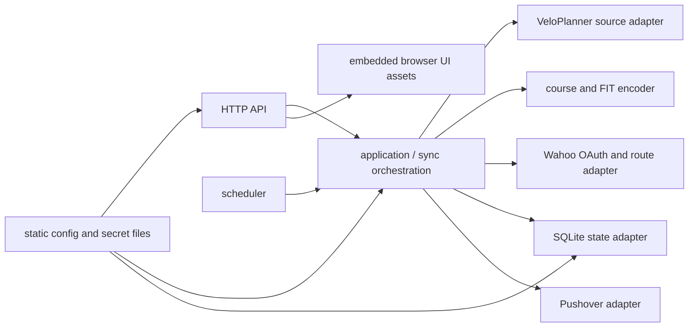

# Domestique service specification

**Status:** accepted v2 design

This document is the normative contract for the Domestique service. Where
implementation details differ from this document, this document wins until it is
deliberately revised.

v2 adds a read-only route map view. It revises three v1 decisions: the service
now has a browser UI, it caches source route geometry locally, and it serves
that geometry to the single authorised Tailnet identity. Everything else in the
v1 contract — the sync safety gates, the secret handling, and the deletion
rules — is unchanged.

## Purpose and scope

Domestique mirrors the complete route library of one private VeloPlanner
account to two separately authorised Wahoo accounts. It runs automatically and
uploads device-ready FIT courses directly to Wahoo; Ride with GPS is not part
of the service.

Each VeloPlanner route stage is a separate Wahoo route. A single-stage route
keeps its route name. A multi-stage route uses `Route — Stage` so its stages are
individually identifiable on a device.

The service is a single-tenant Docker workload for an amd64 or arm64 Tailnet
host. The initial MVP host is macOS with Docker Desktop; the long-running target
is a Linux host, either a Raspberry Pi or a small cloud VM. It has no CLI.

The service serves a read-only browser UI for route preview. Its HTTP surface is
read-only JSON for status, route data, and route geometry, except for the
protected Wahoo OAuth onboarding flow and the manual sync trigger. The UI is a
view onto stored state: it renders one source route stage at a time on a map.

Where a stage's surface classification has been cached, that view draws it: the
route is banded by ground class on the map, and the stage's split is summarised
beside its stored facts. A stage with no cached classification is drawn plainly
and said to be unclassified, never presented as unsurveyed ground. Because the
classification is a derived OpenStreetMap database, the map view carries the
ODbL attribution its share-alike terms require.

Route editing remains explicitly out of scope. The UI presents no editing
affordance, and the service writes nothing back to VeloPlanner. Any future
change to that boundary requires revising this document first.

## Constraints and non-goals

- Sync every route in the configured VeloPlanner library; v1 has no selection
  by tag, prefix, or allow-list.
- Preserve no integration with Ride with GPS.
- Do not provide route editing or a command-line interface. The browser UI is
  read-only.
- Do not run a secret manager or reference a specific secret provider from Go.
- Do not back up the persistent service data. Recovery must be safe despite
  that intentional constraint.
- Do not include credentials, OAuth tokens, personal route fixtures, or the
  Wahoo client secret in this public repository.

## Deployment and access model

Docker publishes the service port only to the host's `127.0.0.1`; the
container has no public host port. The Tailnet host exposes it privately through
`tailscale serve`; it is never directly published to the Internet. All service
endpoints require the configured sole Tailnet identity, apart from a
loopback-only liveness probe if one is needed by Docker. The HTTP server trusts
Tailnet identity headers only from that local proxy.

The map view introduces one deliberate, documented exception to the otherwise
Tailnet-only posture: the operator's **browser** fetches basemap tiles from a
configured third-party tile origin, which reveals the viewport of a viewed route
to that origin. The service itself never contacts the tile origin, and no route
data is sent to it. The default is a keyless provider, so no credential is
exposed to the browser and the requests carry no account identity. The tile
style URL is static configuration so the origin can be changed, or pointed at a
self-hosted tile source, without a code change. A Content-Security-Policy
restricts the browser to the service's own origin plus that single tile origin.

Surface classification introduces a second, larger exception, and it is the
**service** that makes it: to learn whether a stage runs on asphalt, paving,
gravel, or a forest track, it asks an OpenStreetMap Overpass endpoint which ways
lie along that stage, sending a simplified form of the stage's own shape. The
endpoint therefore learns where the operator's routes go — more than the tile
origin learns from a viewport. It is accepted deliberately, because the
alternative is hosting a routing engine beside the service. Only coordinates are
sent: no title, no identity, no account reference. The endpoint is static
configuration, so it can be pointed at a self-hosted Overpass instance, or
cleared to switch the lookup off entirely and leave stages unclassified. Each
stage is asked about once per geometry: the answer is cached and re-fetched only
when the stage's content hash changes.

The Wahoo OAuth redirect URI is the service's HTTPS Tailnet URL:

```text
https://<device>.<tailnet>.ts.net/oauth/wahoo/callback
```

It must exactly match the URI registered with Wahoo and configured in the
service. The authorisation redirect is followed by the user's browser; Wahoo
does not need a public connection to the host.

The state-changing HTTP surface is the OAuth flow:

- `GET /oauth/wahoo/start/{target}` starts authorisation for a configured target
  slot.
- `GET /oauth/wahoo/callback` validates a one-time, expiring OAuth state and
  stores the resulting refresh token.

Both are limited to the configured Tailnet identity. The state binds the
calling identity and target slot and prevents cross-account or CSRF callbacks.
The service rejects an attempt to authorise the same Wahoo account for two
target slots.

Alongside it are the operator controls over synchronization: the manual
triggers, and the two switches that decide what the timer is allowed to start.
They change what the service does next; they change nothing it has stored about
routes, and they cannot make a run less safe than a scheduled one, because a
triggered run is the same run through the same gates. Every one of them is
limited to the same Tailnet identity as the rest of the surface.

A synchronization has two halves, and each is separately switched, triggered,
and reported:

- The **source** half reads the VeloPlanner library, validates it, and stores
  it. It contacts no target and needs no authorisation.
- The **target** half reconciles what is stored onto each Wahoo target. It reads
  the stored library rather than fetching a fresh one, so a target that was
  unreachable catches up from the last inventory known to be whole.

Splitting them lets an operator stop writing to devices while still refreshing
the library, or keep devices current while the source is known to be in flux,
without editing configuration on the host and restarting the service. The
switches govern the timer only: a manual trigger runs its half whether or not
the timer is allowed to, because an operator asking for a run has already
decided. Neither switch stops a run already in flight.

The read-only JSON surface is deliberately small:

- `GET /healthz` reports local process health.
- `GET /v1/status` reports current configuration readiness, last sync outcome,
  aggregate counts, target authorisation state, the two schedule switches, and
  the last run of each half.
- `GET /v1/routes` lists known source routes and stages with their titles and
  aggregate geometry facts.
- `GET /v1/routes/{source-route-id}/stages/{stage}` returns stored route
  metadata, not edit controls.
- `GET /v1/routes/{source-route-id}/stages/{stage}/geometry` returns the stored
  geometry of one stage for map rendering, together with the surface
  classification of that geometry when one has been cached.
- `POST /v1/sync` queues one immediate synchronization of both halves through
  the same reporting path as the schedule. It returns `202 Accepted`, or `409
  Conflict` when a scheduled or manual synchronization is already running.
- `POST /v1/sync/source` and `POST /v1/sync/targets` queue one half on the same
  terms.
- `PUT /v1/sync/schedule` sets both switches, and answers with the state it
  stored. A body that names only one switch is refused: the other would be left
  at whatever the caller assumed it was.

The browser UI is served from the same origin and the same authenticated
listener: an application entry document and immutable hashed static assets.

Exact response schemas are an implementation follow-up. They must never expose
secrets, tokens, or raw upstream response bodies.

Route geometry is served **only** on the dedicated geometry endpoint, only to
the configured Tailnet identity, and only from local stored state. It must never
appear in logs, notifications, error messages, the status endpoint, or the
inventory listing.
The concrete OAuth, sync, persistence, and JSON contracts are defined in the
[sync lifecycle specification](sync-lifecycle.md).

## Configuration and secrets

The concrete file schema and validation rules are defined in the
[configuration specification](configuration.md).

The service has a provider-neutral configuration contract:

- One read-only static configuration file holds non-secret values: VeloPlanner
  account identity and endpoint, Wahoo client ID and API endpoints, target slot
  labels, Tailnet identity, sync cadence, deletion limit, data path, and public
  callback URL.
- Sensitive static values are loaded by Koanf from Docker-style files or the
  documented direct environment variables: VeloPlanner credentials, Wahoo
  client secret, Pushover application token and user key, and a 32-byte
  state-encryption key.
- Dynamic Wahoo refresh tokens are not static configuration. They are encrypted
  at rest in the local state database with an authenticated cipher and the
  state-encryption key. Access tokens are held only in memory.
- Configuration must not understand `op://`, `env:`, provider URIs, provider
  credentials, fnox, or another provider-specific reference syntax. The service
  stays CGO-free.

Docker Secrets, read-only bind mounts, and direct environment values are valid
secret sources. A deployment tool such as `fnox` may provision files, but does
not become an application dependency.

The static configuration defines two named Wahoo target slots. The target's
actual Wahoo user identity is learned and persisted during OAuth onboarding.
Sync remains disabled until every configured target is authorised.

## Persistent state and recovery

A SQLite database on a Docker volume stores:

- Wahoo target identities and encrypted refresh tokens;
- source route/stage identity, source revision, content hash, and Wahoo
  `external_id`;
- a cache of source stage titles and geometry for the route map view, written
  only when a stage's content hash changes and kept in its own table so it can
  be dropped without touching deletion-safety state;
- a cache of the surface classification of that geometry, in its own table for
  the same reason, recorded against the content hash it was measured for so a
  re-planned stage is never described by an earlier plan's answer;
- the corresponding remote Wahoo route identity where available;
- last successful source inventory and last sync outcome; and
- expiring OAuth states.

The database holds no plaintext credential or token. It is intentionally not
backed up.

It does hold the operator's route geometry in plaintext as a rendering cache.
That is personal data rather than a credential, and losing it is harmless — the
next sync refills it from the source — but it raises the sensitivity of the
volume and should inform where the host keeps it.

If the database or volume is lost, the operator must re-authorise every Wahoo
targets. The service must reconcile using the Domestique-owned `external_id`
before it creates or removes routes. It must not treat lost local state as
authority to delete routes from a Wahoo account.

## Source and course representation

VeloPlanner is an unofficial, session-cookie-based source integration using a
private account's username and password. Every sync obtains a fresh authenticated
session before listing routes. The source adapter must retain the proven
baseline behaviour for route geometry:

- read VeloPlanner's ordered stages and segments;
- join each stage's decoded `[longitude, latitude, elevation]` points in order;
- preserve elevation when present;
- emit one course per non-empty stage; and
- use the source route ID and stage order as stable identity, never the route
  title.

The service normalizes fully-elevated source-stage elevations before device
export: it samples the elevation profile at 25-metre intervals and applies a
centred 100-metre moving median to remove isolated altitude spikes. It retains
the original route geometry. The resulting profile is the single source for
FIT elevations and Wahoo ascent/descent metadata. Each FIT record carries
cumulative route distance in metres as well as coordinates and elevation, so
Wahoo can derive an elevation profile and gradients. The initial FIT adapter may use
[`github.com/muktihari/fit`](https://github.com/muktihari/fit), isolated behind
the course encoder boundary and without vendoring Garmin SDK files or test data.
The source code remains MIT-licensed; third-party notices remain with their
respective dependencies. Operating the service requires compliance with the
[FIT Protocol License](https://www.thisisant.com/developer/ant/licensing/flexible-and-interoperable-data-transfer-fit-protocol-license).

Before adopting an encoder, an acceptance test must decode the generated FIT,
upload it to the Wahoo sandbox, and confirm the resulting course is usable by a
Wahoo account. No personal route data belongs in repository fixtures.

## Wahoo synchronisation

Wahoo is the only destination. The service uses the approved confidential Wahoo
Cloud application with `routes_read`, `routes_write`, and `user_read` scopes.
The configured Wahoo environment may be sandbox; it is valid for this service
within its lower rate limits.

For every source stage and Wahoo target, Domestique derives a deterministic
`external_id` from the source route ID and stage order. It supplies that ID and
the source revision as `provider_updated_at` when it creates or updates a FIT
route. A changed source stage updates the existing owned Wahoo route rather
than using an upload-and-delete replacement.

OAuth refresh is serialised per Wahoo account. A refresh token returned by a
successful refresh replaces the prior stored token atomically before any later
request can use stale credentials. The Wahoo application is rate-limited across
all configured targets: API calls are serial, obey advertised limits, and resume only
when safe to do so.

Domestique deletes only Wahoo routes it owns through its `external_id`. A
source-stage deletion removes the corresponding owned Wahoo route from both
targets. It never deletes manually created Wahoo routes.

## Sync lifecycle and safety

The detailed state transitions and safety gates are defined in the
[sync lifecycle specification](sync-lifecycle.md).

The service attempts one sync shortly after a healthy startup and then hourly.
At most one sync may run at a time. It fetches the source inventory once, then
processes configured Wahoo targets serially so one account's failure does not stop
an attempted update of the other. The overall run is failed if either target
fails.

No automatic run may delete more than five owned Wahoo routes from a target.
Before any deletion, the source inventory is checked against the last trusted
inventory. Authentication failure, malformed source data, an empty result after
a previously non-empty library, or a suspicious shrink stops deletion and raises
an alert. A normal small, authenticated source deletion is mirrored.

Source authentication and inventory safety are more important than making a
deletion immediate. A final-library deletion that would appear as an empty
source requires an explicit static configuration acknowledgement before it can
delete Wahoo routes.

Every run records a terminal outcome. Pushover receives:

- a concise aggregate success notification after every successful sync; and
- the first failure notification immediately, followed by suppression of
  identical failures for six hours.

Notifications contain aggregate counts and a safe failure category only. They
contain no route names, tokens, credentials, or raw upstream errors.

## Go design

The concrete package boundaries, interface rules, manual composition root, and
delivery sequence are defined in the
[implementation architecture specification](implementation-architecture.md).

The implementation is package-oriented with manual wiring in the server
entrypoint. Packages own their own data types and expose narrow interfaces only
at consumer boundaries. There is no dependency-injection framework, shared
`interfaces` package, or global service locator.

The intended dependency direction is:



`application` defines the source, destination, state, and notification
interfaces it consumes. Adapters do not import each other. `cmd/domestique`
only loads configuration, constructs concrete adapters, starts the scheduler,
and performs graceful shutdown.

## Quality and delivery requirements

The concrete local quality gate, GitHub Actions, container hardening, and
release artifact contract is defined in the
[delivery specification](delivery.md).

Implementation must include a project-local Go toolchain declaration, focused
`golangci-lint` configuration, `prek` local checks, and GitHub Actions that run
the same essential validation. Normal tests use deterministic fakes for every
external service. A separately invoked sandbox acceptance check validates the
FIT/Wahoo contract and never receives production secrets through CI.

Released Docker images are published to GHCR from version tags, signed, and
deployed to the Pi by immutable digest. The macOS MVP may build locally from
the checkout; its configuration and Docker secret files remain outside Git.

## Acceptance criteria

- Two Wahoo accounts can be authorised through the Tailnet-only OAuth flow.
- An hourly run mirrors every valid VeloPlanner stage to every configured target as FIT.
- Edits preserve the stage's `external_id`; source deletions remove only owned
  destination routes and respect the deletion guard.
- A failed source inventory cannot cause a destructive Wahoo deletion.
- Lost state cannot cause deletion of unknown Wahoo routes.
- The service logs and notifications do not reveal secrets or route details.
- Every HTTP interaction is Tailnet-identity-gated. Beyond OAuth, the only ones
  that change anything are the synchronization triggers and the two schedule
  switches; nothing on the surface edits stored route data.
- The browser UI renders a stored source stage on a map, is reachable only by
  the configured Tailnet identity, and offers no editing affordance.
- Stage geometry is cached locally and rewritten only when a stage's content
  hash changes, so an unchanged library does not rewrite the cache on every run.
- Losing the geometry cache degrades only the map view; it cannot affect sync
  safety or cause a destructive Wahoo operation.
- The codebase has reproducible local and GitHub validation before a release is
  published.
