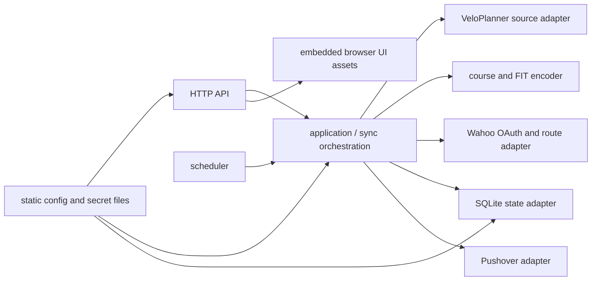

# Domestique service specification

**Status:** accepted

This document is the normative contract for the Domestique service. Where
implementation details differ from this document, this document wins until it is
deliberately revised.

## Purpose and scope

Domestique mirrors the complete route library of one private VeloPlanner
account to two separately authorised Wahoo accounts. It runs automatically and
uploads device-ready FIT courses directly to Wahoo; Ride with GPS is not part
of the service.

Each stage of a VeloPlanner source route is one route here, and each is a
separate Wahoo route. A source route with one stage keeps its own name. One
with several uses `Source route — Route`.

The service is a single-tenant Docker workload for an amd64 Tailnet host, which
is the only architecture the image is published for. The long-running target is a
small Linux cloud VM. It has no CLI.

The service serves a read-only browser UI for route preview. Its HTTP surface is
read-only JSON for status, route data, and route geometry, except for the
protected Wahoo OAuth onboarding flow, the manual triggers over synchronisation
and surface enrichment, and the runtime settings the UI reads and writes back.
The UI is a view onto stored state: it draws the whole stored library on one map,
opens any one route over that same map, and reports synchronisation on a second
view. A route is not a page of its own — it takes over the panel the search
occupies and adds its own layers to the map already on screen. The route being
read is carried in the address, and the view is linkable.

## HTTP wire contract

[`api/openapi.yaml`](../../api/openapi.yaml) is the normative API contract for
the browser API, OAuth flow, and loopback probes: JSON properties, response
codes, media types, headers, redirects, and the session and Origin
requirements.
The browser document, static assets, and client-side navigation are application
routes, not API operations. The prose specifications retain lifecycle, safety,
and operating rules; they do not define a competing JSON shape.

All Domestique JSON is camelCase, apart from the standard Web Manifest's
specified property names. The one geometry response is a GeoJSON Feature served
as `application/geo+json`; its stored coordinates and surface ranges pass
through without decoding and re-encoding. Deploying this wire change requires a
browser hard reload. There is no compatibility endpoint or public SDK.

The contract is enforced at runtime rather than only described. Every request is
held to the document before it reaches a handler: the parameter bounds, the
request bodies, and the provenance requirement that marks an operation as
state-changing. A request the document does not describe is refused with the
shared error shape.

Two checks sit outside that validation and in front of it. The Access identity
is proven before the validator resolves a route: a caller that has proven
nothing is answered 401, never "no such route". The request body is capped
before the validator reads it.

Every `type: number` in the contract is IEEE 754 double precision, declared as
`format: double`. Identifiers and counts are `type: integer` and stay integral;
a route identifier is an int64. Every timestamp is RFC 3339 in UTC, at second
resolution.

Where a route's surface classification has been cached, the view draws it: the
route is banded by ground class on the map, and the route's split is summarised
beside its stored facts. A route with no cached classification is drawn plainly
and said to be unclassified, never presented as unsurveyed ground.

The view marks both terminals of a route and the direction of travel. The start
and the finish are marked distinctly and stay distinguishable on a route that
finishes where it started; the two markers are separated on screen rather than
drawn on one point. Direction cues are placed along the route at a spacing
measured on screen, so a route gets the same restrained handful of them whatever
its length and however far the camera is pulled back. Every cue is derived from
the stored geometry already drawn, and no request is made to answer it. Every
cue has a textual equivalent stating which way the ride leaves, whether it
returns to its start, and which way it comes back.

A surface class or a gradient band can be selected from the key. The stretches
of route it covers stay lit on the map and in the elevation chart while the rest
of the ride is dimmed. One class at a time; selecting it again restores the whole
route. This changes what is emphasised, never what is stored.

A stretch of the ride is asked for the same way on either instrument: a drag
across the elevation chart, or a drag along the painted route, selects the
distance range it covers, and both views then show that stretch until the whole
route is asked for again. A drag that begins away from the route moves the map
instead, and moving the map selects nothing. Selecting a stretch by keyboard
belongs to the elevation chart alone. This too changes what is shown, never what
is stored.

The map holds its own gestures throughout: the wheel zooms, fingers pan and
zoom, and the arrow keys answer. Nothing is printed over the cartography to ask
for them. A drag that begins on the painted route picks a stretch of the ride
instead of moving the camera.

The elevation chart floats across the foot of the map rather than sitting in a
column beside it, and it can be folded away to a pill that still states the
route's total climbing and the heights it runs between. That choice lasts as
long as the tab and is not stored.

The UI carries one outbound link, to this service's public source repository. It
is the only navigation that leaves the authenticated origin, it opens in a new
context without a referrer, and it sends nothing: no route, geometry, or
origin address accompanies it.

Route editing is out of scope. The UI presents no editing affordance, and the
service writes nothing back to VeloPlanner. Any change to that boundary requires
revising this document first.

## Constraints and non-goals

- Sync every route in the configured VeloPlanner library; there is no selection
  by tag, prefix, or allow-list.
- Preserve no integration with Ride with GPS.
- Do not provide route editing or a command-line interface. The browser UI is
  read-only.
- Do not run a secret manager or reference a specific secret provider from Go.
- Do not back up the persistent service data. Recovery must be safe despite
  that intentional constraint.
- Do not include credentials, OAuth tokens, personal route fixtures, or the
  Wahoo client secret in this public repository.

## Deployment and access model

Docker publishes the service port only to the host's `127.0.0.1`; the
container has no public host port. A TLS-terminating reverse proxy — Traefik in
the same compose project is the documented example — is what makes the service
reachable at all: it terminates TLS, forwards the served listener alone, must
never forward the readiness listener, and must never add or trust an identity
header of its own. How it reaches that listener is the deployment's business,
over a private container network or the loopback publish; what the contract
fixes is that nothing but the proxy's own port is reachable from outside.
The service is therefore publicly reachable, and `GET /healthz` along with it;
[the Auth0 guide](../auth0.md) covers the proxy in full.

All service endpoints require a session, apart from the unauthenticated
surface below and the readiness probe on its own loopback listener, which is
reachable from host-local health checking alone.

The unauthenticated surface is exactly `GET /healthz`, `GET /auth/login` — the
application entry document, offering a sign-in and writing nothing — `POST
/auth/start`, `GET /auth/callback`, `POST /auth/logout`, and the build
artefacts that document loads: the hashed assets under `/assets/`, the
favicon, the two installed-copy icons, and the manifest. Those artefacts are
compiled output holding no state and no route data, and the sign-in page
cannot render without them. `GET /healthz` reads nothing and
answers static fields; the proxy example refuses it with `404`, but the
service is correct whether or not the proxy does. Everything else requires a
session: a page request without one is redirected to `/auth/login`, and an
API request without one answers JSON `401`.

Every subject Auth0 lets sign in shares the route library and its
synchronisation: what the source read holds and what it writes to Wahoo are
the same for everyone signed in. Wahoo targets are not shared the same way — a
non-admin subject sees and controls only their own target, created by their
own "Connect," while an admin subject sees and controls every target that
exists. That split is a separate namespaced claim the same Action asserts (see
below), not a second sign-in decision; every admitted subject proves
membership the same one way: a session this service itself issued.

The same claim also decides who administers the service. The shared settings,
the background activities and their schedules, and the per-route reprocess
request belong to an admin subject: the endpoints marked admin-only below
answer `403` in the shared error shape to any other session, and the two
admin browser routes answer not found. The one thing a non-admin may start is
`sync:target` over their own subject. Those rights come from the namespaced
claim the Action asserts and from nothing else — no header, no local list, and
no second gate.

A session is created only by an authorisation-code flow with PKCE (S256) and a
nonce, run against the configured Auth0 tenant through its own SDK. The
service validates the ID token Auth0 returns itself — signature (RS256),
issuer, audience equal to the configured client ID, expiry, and nonce — and
then reads one namespaced claim the tenant's post-login Action asserts: whether
this subject may hold a session at all. Who that Action admits, and on what
terms, is the tenant's own configuration, not something this file holds; a
subject the Action does not admit is refused before Auth0 ever issues a code,
answering the callback with `error=access_denied` instead.

Whether a subject may still sign in is decided at sign-in time, not re-checked
against anything live on every later request, so the session itself has to
bound how long a revoked subject's access can keep working: the gate is a
session cookie, `__Host-domestique_session`, carrying an opaque 256-bit token;
only its SHA-256 is stored, in `web_sessions`. It is `Secure`, `HttpOnly`,
`SameSite=Lax`, scoped to `Path=/` with no `Domain`, and fixed at a 24-hour
expiry — not renewed on use, so a subject is forced back through a real Auth0
round-trip within a day of any change to the Action's own decision. Signing
out revokes it server-side. Sessions live in the state database and share its
fate: a lost database signs every subject out, which is a sign-in problem
rather than a recovery one. No identity header — `Cf-Access-Jwt-Assertion`,
`Cf-Access-Authenticated-User-Email`, or `Tailscale-User-Login` — is ever read.

Every state-changing endpoint additionally requires an `Origin` header exactly
equal to the origin the browser UI is served from — `http.browser_origin_url`,
which is by declaration the hostname a browser reaches this service at, and from
which the Wahoo callback and the Auth0 callback are both derived. A missing,
malformed, `null`, or cross-site origin is refused with 403 before any trigger
runs or any state is written. A browser attaches `Origin` to every request
whose method is not GET or HEAD, including a same-origin one. This is a
security requirement, not an implementation detail. Sign-in start
(`POST /auth/start`) and sign-out (`POST /auth/logout`) join the
state-changing surface on those terms.

The Wahoo OAuth callback and `GET /auth/callback` are the two documented
exceptions to that rule. Both are a cross-site GET the browser is redirected
into rather than a request the page itself issues, and each carries its own
one-time, expiring, identity-bound state instead: the Auth0 callback's state
must also be presented back in a `__Host-domestique_login` cookie the same
browser was given when it started. Most refusals never reach this service at
all — the Action denies them before Auth0 issues a code, and the callback
answers `error=access_denied`. A subject that does complete the exchange
without the access claim — the Action disabled or misconfigured, say — is
shown their own `sub` on the resulting 403 page instead, the one place this
service will ever display a subject value; it is never written to a log,
which carries a stable category only.

The map view is one documented exception to the otherwise session-gated
posture.
The operator's **browser** fetches basemap tiles from a configured third-party
tile origin, and the area those tiles cover is the viewport on screen: a viewed
route's, or, once the reader presses the map's locate button, an area centred on
their own live position. The service itself never contacts a tile origin. The
raw coordinates the locate button reads from the browser's Geolocation API move
the camera and go nowhere else: they are never sent to this service, a log,
storage, or the tile origin as a discrete value. Only the resulting tile
requests, naming the area rather than a point, reach it. The default is a single
keyless provider, so no credential is exposed to the browser and the requests
carry no account identity. The basemaps are a runtime setting, so an origin can
be changed, or pointed at a self-hosted tile source, without a code change.

An operator may configure more than one basemap so the reader can switch between
them. A Content-Security-Policy restricts the browser to the service's own
origin, the origin of each configured basemap, and the hosts those basemaps'
style documents name for their glyphs, sprites, and tiles — a provider is free
to split those across hosts, and a policy naming only the configured origin
leaves the reader a map with no labels or no streets. Those hosts are in the
document rather than in the settings, so the service reads each configured style
to learn them; that read is the one request it makes to a tile origin on its own
behalf, and it carries nothing about any route or any reader. The policy names
which origins the page *may* reach; only the basemap on screen is ever
requested. A second style may be configured for a dark system colour scheme, and
must be on **its own basemap's** origin.

The reader's pick is remembered in the browser's own storage, under one key
holding the chosen basemap's name and nothing else. It is never sent anywhere:
the service is not told which basemap a browser loads, and the choice is kept
out of the address, so a shared link to a route does not carry it. A browser that
refuses storage still switches; it starts again from the first entry on the next
visit.

Surface classification introduces **no** such exception. The service reads a
surface index it builds itself from OpenStreetMap regional extracts, and the
whole classification happens on the host with no request leaving it. No route
shape is ever sent anywhere. The only outbound traffic is the scheduled rebuild:
on its own cadence the service downloads the configured regions' published
extracts from the extract host, which learns which regions this deployment is
interested in and nothing about any route. An operator who configures no region
downloads nothing and leaves routes unclassified.

Each route is classified once per geometry per index build. The answer is cached
against both the route's content hash and the generation of the index it was
read from. A route is reclassified when its shape changes and when the map
underneath it is rebuilt, and at no other time.

Open-Meteo is the second service the deployment itself reaches outbound, after
the OpenStreetMap extract download above. The service asks Open-Meteo for an
hourly forecast at the coordinates and times `GET /v1/weather` was given. A
viewed route's shape and timing are what leaves; the request carries no identity.

The tile origin is the third, and the narrowest: the service reads the
configured style documents so the policy can admit the hosts they name, and
nothing else. Every tile, glyph, and sprite is still fetched by the operator's
**browser** alone; which area a reader is looking at never reaches the tile
origin from this service.

Every credit this service owes is shown in one place, the settings page, and
nowhere else in the UI: no credit is drawn over the map or beside the forecast.

The derived OpenStreetMap database the surface classification is built from
requires ODbL attribution, and Open-Meteo's forecasts require attribution under
its [CC BY 4.0 licence](https://open-meteo.com/en/licence). Both are constants
this service states itself, and both are always shown.

Each configured basemap requires whatever credit its own style document
declares, and that credit is read from the provider rather than held here, so it
is shown when the style can be read. A style this service cannot reach or parse
leaves the map uncredited, and costs no other credit on the page.

The Wahoo OAuth redirect URI is the HTTPS URL a browser returns to, the public
hostname plus `/oauth/wahoo/callback`:

```text
https://<hostname>/oauth/wahoo/callback
```

It must exactly match the URI registered with Wahoo and configured in the
service. The authorisation redirect is followed by the user's browser; Wahoo
does not need a public connection to the host. The Auth0 callback is derived
from the same origin the same way, as `/auth/callback`, and must be registered
with Auth0 exactly.

The state-changing HTTP surface is sign-in, sign-out, and the Wahoo OAuth flow:

- `POST /auth/start` begins a sign-in against the configured Auth0 tenant.
- `GET /auth/callback` validates the returned authorisation code and issues a
  session, on the terms described above.
- `POST /auth/logout` revokes the caller's session and always answers `204`.
- `GET /oauth/wahoo/start` starts authorisation for the caller's own target,
  creating it on first use. The browser is never told its own subject, so this
  bare path is the only way a caller with no target yet can start one at all.
- `GET /oauth/wahoo/start/{target}` starts authorisation for a named target: a
  non-admin may only name their own subject, which the bare path above already
  covers; an admin may name any target that already exists. Either way a name
  this rule refuses is answered not found, so a non-admin cannot learn which
  other targets exist.
- `GET /oauth/wahoo/callback` validates a one-time, expiring OAuth state and
  stores the resulting refresh token.

The Wahoo pair is limited to a session belonging to an allowed subject. The
state binds the calling identity and target and prevents cross-account or CSRF
callbacks. The service rejects an attempt to authorise the same Wahoo account
for two targets. The Wahoo callback joins the Auth0 callback as the surface's
other documented exception to the `Origin` rule, for the same reason: both are
a cross-site GET the browser is redirected into.

Alongside it are the operator controls over the background activities: starting
one by name, the per-task switches that decide what a schedule is allowed to
start, and the per-route reprocess request. They change what the service does
next; they change nothing it has stored about routes. A triggered run is the
same run through the same gates as a scheduled one, and an enrichment pass
asked for by name is narrower still: it never reads VeloPlanner or writes a
Wahoo target, only reworking what is already stored. Every one of them is
limited to a session belonging to an allowed subject, as the rest of the
surface is.

Beside those is the one write that changes what the service *is* rather than
what it does next: the settings write stores the runtime settings an operator
edits from the UI, defined in
[the configuration specification](configuration.md#runtime-settings). It reaches
no route, and what it writes is validated by the same rules that would have been
applied to it at startup. It is also the only endpoint that accepts a credential,
and it is write-only in both directions of that word: a submitted credential is
stored encrypted and is never read back out, by this endpoint or any other.

A synchronisation has two halves, and each is separately switched, triggered,
and reported:

- The **source** half reads the VeloPlanner library, validates it, and stores
  it. It contacts no target and needs no authorisation.
- The **target** half reconciles what is stored onto each Wahoo target. It reads
  the stored library rather than fetching a fresh one, so a target that was
  unreachable catches up from the last inventory known to be whole.

The switches govern the timer only. A manual trigger runs its half whether or
not the timer is allowed to. Neither switch stops a run already in flight.

The read-only JSON surface is small:

- `GET /healthz` reports local process health, on the served listener, to any
  caller including one off the reverse proxy — it reads nothing and returns
  static fields.
- `GET /readyz`, on the readiness listener alone, reports whether local
  configuration and the state the process needs are usable. It verifies nothing
  else: no VeloPlanner, Wahoo, Pushover, Auth0, or tile provider
  call, and no judgement about whether a target has completed its one-time
  authorisation. It reports a fixed category when it is not ready, never a path,
  key, or upstream detail.
- `GET /v1/status` reports current configuration readiness, last sync outcome,
  aggregate counts, target authorisation state, the
  last run of each half, and how much of the library carries a current surface
  classification together with which map build it was read from. It also reports
  whether every stored route at its current revision has reached every configured
  target: one convergence word, safe aggregate current and pending counts, and
  the last reconciliation result per target, plus one overall answer that is true
  only when every target is current. A non-admin subject's answer names only
  their own target — zero or one, never another's — and the overall answer is
  computed over that same, scoped set; an admin's names every target that
  exists, each carrying who owns it, and marks the one owned by the calling
  admin's own subject so the browser can tell it apart without being told its
  own identity. Those are derived from stored revisions
  alone, never by asking Wahoo what it holds, and they describe the Wahoo
  accounts rather than what any physical head unit has downloaded. It also names
  the build that is running: the full public source commit the binary was
  compiled from, and the digest of the image carrying it when the host told the
  service one. That group is absent for a build that carries no injected
  revision. Only a full commit object name and a bare `sha256:` digest are
  served; a value that is neither is dropped rather than published. No registry,
  repository, host, tag, or path is included.
- `GET /v1/sync/runs` returns a bounded, paginated history of terminal runs,
  newest first: each one's opaque reference, half, completion time, result, safe
  failure category, and aggregate counts. Older runs are pruned as new ones are
  recorded, so it is recent history rather than a permanent record. It is the one
  read that takes query parameters: a bounded page size, and the cursor the
  previous page ended with.
- `GET /v1/routes` lists every stored route with its source route and titles,
  aggregate geometry facts, and — when a ride-model coefficient file is
  configured and has predicted this exact geometry — a predicted moving time.
  It is omitted, never zero, for a route nothing has predicted yet.
- `GET /v1/providers/{provider}/sourceRoutes/{source-route-id}/routes/{stage-order}`
  returns stored route metadata, not edit controls. Two further shapes of this
  address redirect to it with `308`.
- `GET /v1/providers/{provider}/sourceRoutes/{source-route-id}/routes/{stage-order}/geometry`
  returns the stored geometry of one route for map rendering, together with the
  surface classification of that geometry when one has been cached, and — when a
  ride-model coefficient file is configured and has predicted this exact
  geometry — the predicted cumulative moving time at each coordinate, indexed
  1:1 with the geometry. It is omitted, never empty, for a route nothing has
  predicted yet.
- `GET /v1/webui/config` returns the settings the browser UI needs at runtime so
  the built assets stay static: the list of basemaps the map may be switched
  between — each with its name, style URL, optional dark style URL, and whether
  its cartography is dark in either colour scheme — and the source provider's
  base URL. The list is never empty, and its first entry is what a browser that
  has chosen nothing loads. The base URL is the whole of what is sent about the
  provider; the page builds a route's link back to its source route from it. It
  is omitted when unconfigured, and the page then shows no such link. It also
  reports the signed-in subject's display name: the ID token's email, else its
  name, else the bare `sub`.
- `GET /v1/settings` (admin-only) returns every setting an operator may change while the
  service is running: the synchronisation settings, the notification settings,
  the basemap list, the surface settings, the Wahoo application, the source
  libraries, and the ride model. It is one document and the whole of it every
  time, whichever section is about to be edited. Which targets exist is not
  among these settings: each is created by its own owning subject, on their own
  first connection, not written here.

  It carries **no credential value**. It reports, per stored credential, whether
  one is set at all, and it names what is still to be entered: everything a run
  needs, and the Pushover credentials while notifications are on. It carries no
  static configuration — [the configuration
  specification](configuration.md#runtime-settings) states which settings live
  here and which stay in the file.
- `GET /v1/weather` returns an hourly forecast for up to 48 repeated `point`
  values, so the page can show a ride's weather without reaching Open-Meteo
  itself. Each `point` is `latitude,longitude,time`: decimal-degree latitude
  and longitude, and a full RFC3339 timestamp with an offset (or `Z`) and
  seconds. Each point is answered with the single hour of its own
  coordinate's series nearest its own requested time — never Open-Meteo's
  field names or its raw payload. A malformed point, more than 48 of them, or
  a window Open-Meteo could not answer is refused as `400` before any
  outbound call; a provider failure is `502`, carrying no upstream response
  text.

The endpoints below that change state — the task runs, the schedule switches,
the reprocess request, and the settings write — additionally require the
browser origin described above, and answer 403 without it.

- `POST /v1/tasks/{name}/run`, and `/run/{argument}` for one over an argument,
  start a single attempt of a background activity. It returns `202 Accepted`,
  or `409 Conflict` when that exact work is already happening or something it
  needs is held by another run. A name this build does not register is refused
  as `404`.

  An argument is the task's own to interpret, not this surface's — except for
  `sync:target` and `sync:clear`, where it names a target and this surface
  refuses it before the task layer ever sees it. An admin may name any target,
  and for `sync:target` may leave the argument empty, meaning every target. A
  non-admin's argument must be their own subject; anything else, the empty
  argument included, is answered `404` the same as a name that does not exist,
  so a non-admin cannot learn which other targets exist.
  Every other task is service administration: a non-admin asking for one — the
  source read, a surface rebuild, `sync:clear`, any of them — is answered
  `403`, the target-scoping `404` above taking precedence where both apply.

  Past that gate, a target that does not exist is accepted and recorded as
  `skipped` rather than refused: the refusal that matters is in the service — a
  clear or a reconciliation of a target that does not exist does no work. The
  attempt is recorded in `task_runs`, but nothing on this surface reads it
  back; an operator learns of a typo'd target only by the reconciliation it
  never produces.

  `sync:clear` deletes every route this service owns from one target and
  forgets that target's route mappings. It is the one deletion the per-target
  deletion limit does not bound, and nothing schedules it. It still deletes only
  routes carrying an external ID this service issued, and leaves the stored
  library untouched, so the next reconciliation rebuilds the target.
- `GET /v1/tasks` (admin-only) lists what this build registers: whether each has a schedule,
  whether that schedule may start it, how many attempts are in flight, and when
  the first scheduled run is due. `GET /v1/tasks/runs` pages what those
  activities have been doing, newest first, and is admin-only too.
- `PUT /v1/tasks/{name}/schedule` (admin-only) sets whether the schedule may start one task,
  and answers with the registered tasks as they now stand. It governs unattended
  runs only.
- `POST /v1/providers/{provider}/sourceRoutes/{source-route-id}/routes/{stage-order}/reprocess`
  (admin-only) asks for one route to be worked out again from scratch and starts the read
  that will do it, as `sync:source` run on that stage's behalf. What the targets
  hold follows from that read. It returns `202 Accepted`, or `404` for a
  route that is not in the stored inventory.
- The settings are written one section at a time (admin-only), over one endpoint per
  section: `PUT /v1/settings/wahoo` for the registered application,
  `/v1/settings/sources/{provider}` for one library and the account it is read
  with, and `/v1/settings/notifications`, `/v1/settings/basemaps`,
  `/v1/settings/surface`, `/v1/settings/ridemodel` and `/v1/settings/sync` for
  the rest. The `{provider}` a source path names is one of the libraries the
  service reads; any other is refused. Writing the surface section also starts
  a surface-index rebuild, and writing the ride-model section a prediction
  pass, on the terms a manual trigger starts one: the change is what those
  passes consume, and the next scheduled run is otherwise up to a rebuild
  interval away.

  Each replaces the whole of the section it names. A body naming only some of
  that section's fields is refused. Sections the request does not name are not
  merged and not touched: a section is edited by the endpoint that owns it or not
  at all. The edit is applied to the settings as they are at the moment of the
  write.

  A value the service would have refused at startup is refused here as `400`,
  in a message naming the setting, and what it stores is in force for the next
  request and the next run without a restart. Each changes what the service does
  next; none changes anything it has stored about a route, and none reaches a
  listener address, the browser origin, or the identity gate, none of which is a
  runtime setting.

  Credentials travel with the section that owns them — the client secret with
  the application, an account with its library, the Pushover pair with the
  notifications — and are the one part of a body that is not whole-object: a
  request carries only the ones actually typed into the form, one left out keeps
  its stored value, and one sent empty removes it. A credential offered to a
  section that does not own it is refused as `400`. A section refused for any of
  these reasons stores neither its values nor the credentials it carried.

  Every one of these answers with the same document `GET` returns — every
  setting now in force, not only the section the request replaced — and nothing
  that was submitted as a credential appears in it.

The browser UI is served from the same origin and the same listener: an
application entry document and immutable hashed static assets. `/auth/login`
is the one unauthenticated browser entry route, and serves that same entry
document: the sign-in form is the application's, and this service renders no
HTML of its own. `/`, `/catalogue`, `/sync`, and `/settings` require a
session, and `/admin` and `/admin/tasks` require an admin session: any other
session is answered not found rather than `403`, since a document is not one
of the contract's operations. The catalogue reads the same inventory listing `/` does and asks the
service for nothing of its own: it is the library as a sortable table, and the
ordering, searching and narrowing it offers all happen in the browser. Settings
holds two kinds of preference and keeps them apart, and lists the data sources
this service credits: the theme and the units are this browser's alone and stay
in its local storage, while the service's runtime settings are read and written
over the endpoints above and are the same for every browser. It does not alter
the route or moving-time contracts, and unknown paths remain JSON `404`
responses.

The response schemas are defined in
[the sync lifecycle specification](sync-lifecycle.md). They must never expose
secrets, tokens, or raw upstream response bodies.

Route geometry is served **only** on the dedicated geometry endpoint, only to
a session belonging to an allowed subject, and only from local stored state.
It must never appear in logs, notifications, error messages, the status
endpoint, or the inventory listing.

The concrete OAuth, sync, persistence, and JSON contracts are defined in the
[sync lifecycle specification](sync-lifecycle.md).

## Configuration and secrets

The concrete file schema and validation rules are defined in the
[configuration specification](configuration.md).

The service has a provider-neutral configuration contract:

- One read-only static configuration file holds what the host has to know
  before the process can serve anything: the two listener addresses, the origin
  a browser reaches the service at, the Auth0 tenant domain and client id, and
  the state database's path and key file. Who may sign in is not among them —
  that is the tenant's own Action, not this file.
- Everything that decides what work the service does is not in that file. The
  provider endpoints, source libraries, ride model, schedule and credentials
  are held in the state database, edited over the settings endpoints, and in
  force without a restart; the
  [configuration specification](configuration.md#runtime-settings) defines them.
  A deployment that has configured none of them starts, serves the settings
  page, and runs nothing. Targets are held in the same database but are not
  among these settings: each is created by its own owning subject connecting,
  not written by an operator.
- Two sensitive static values are loaded by Koanf from a Docker-style file or
  the documented direct environment variables: the 32-byte state-encryption
  key and the Auth0 client secret. Every other credential — the source
  accounts, the Wahoo client secret, and the Pushover pair — is entered on the
  settings page and encrypted under the state key.
- Dynamic Wahoo refresh tokens are not static configuration. They are encrypted
  at rest in the local state database with an authenticated cipher and the
  state-encryption key. Access tokens are held only in memory.
- Configuration must not understand `op://`, `env:`, provider URIs, provider
  credentials, fnox, or another provider-specific reference syntax. The service
  stays CGO-free.

Docker Secrets, read-only bind mounts, and direct environment values are valid
secret sources. A deployment tool such as `fnox` may provision files, but does
not become an application dependency.

The static configuration defines two named Wahoo target slots. The target's
actual Wahoo user identity is learned and persisted during OAuth onboarding.
Sync remains disabled until every configured target is authorised.

## Persistent state and recovery

A SQLite database on a Docker volume stores:

- Wahoo target identities and encrypted refresh tokens;
- source route/route identity, source revision, content hash, and Wahoo
  `external_id`;
- a cache of route titles and geometry for the route map view, written
  only when a route's content hash changes and kept in its own table so it can
  be dropped without touching deletion-safety state;
- a cache of the surface classification of that geometry, in its own table for
  the same reason, recorded against both the content hash and the surface-index
  generation it was measured for. The two are not acted on alike: a changed
  content hash withdraws the cached answer, whose ranges are positions in a
  geometry the route no longer has, while a newer index leaves it on display and
  marks the route for re-measurement on the next enrichment pass;
- when the last surface index build finished and which generation it produced.
  The rebuild interval is measured between builds rather than from process
  start;
- the corresponding remote Wahoo route identity where available;
- last successful source inventory and last sync outcome; and
- expiring OAuth states.

The database holds no plaintext credential or token. It is intentionally not
backed up.

The schema is versioned by an append-only migration history, and migrations run
forward only. There is no backup, and rollback onto the previous image must
remain possible after a migration:

- every migration must leave the previous release's binary able to read and
  write what it already did — additive with defaults. A migration must not drop
  or rename anything a preceding binary uses, add a `NOT NULL` column without a
  default to a table a preceding binary inserts into, tighten a `CHECK` or add a
  `UNIQUE` index a preceding binary's writes could violate, or change what an
  existing column's values mean; and
- a binary opens a state file up to one migration ahead of itself, and refuses
  one further ahead than that with a distinct error. A release that must stay
  rollable therefore appends one migration.

The rollback path never restores or replaces state; the tolerance is what makes
the previous image usable against a state file the failed deploy migrated.

The initial `golang-migrate` migration is a current-schema baseline at legacy
version 27. Existing databases are adopted only when their
`schema_migrations` watermark is the contiguous legacy sequence through version
27 and their schema matches the baseline; the baseline is then marked applied
without running its DDL. Older, dirty, or drifted databases are rejected.
The schema fingerprint is compared whenever the schema changes hands: on
adoption and after applying migrations. A database already at the current
version opens after an integrity and foreign-key check alone; a manual edit
that leaves both watermarks current is outside what startup detects.

`schema_migrations` remains the compatibility watermark for prior application
releases, while `domestique_migrations` is owned by `golang-migrate`. Each
future migration advances both watermarks at the same version so the previous
release can open a database that is one migration ahead.

Two migrations are recorded exceptions to the first rule.

The migration that gave a route's identity its provider widened the primary key
of `target_stages`, `stage_geometry`, `stage_surface`, and `stage_reprocess` to
include the new column. A binary from before that migration writes those four
tables through `ON CONFLICT (route_id, stage_order)`, and SQLite requires that
column list to name an existing unique constraint exactly, so those statements
do not prepare against the widened key. A rollback across this migration can
still **read** all four tables — no state is lost or rewritten — but cannot
write them, and synchronisation fails until the deployment rolls forward again.

The camelCase HTTP cutover rewrites only the cached JSON bytes in
`stage_surface.ranges`, which keeps existing geometry a raw pass-through
response rather than one decoded and re-encoded by the handler. A binary from
before that cutover serves the new range field names, so a failed deployment
must roll forward after the browser hard reload rather than rolling back across
it. No route data, ownership record, or sync safety state changes meaning.

Both exceptions license the one change each describes, not a general relaxation.
A future migration carries the same obligation to be additive.

The database holds the operator's route geometry in plaintext as a rendering
cache. That is personal data rather than a credential, and losing it is
harmless: the next sync refills it from the source. It raises the sensitivity of
the volume and should inform where the host keeps it.

If the database or volume is lost, the operator must re-authorise every Wahoo
target. The service must reconcile using the Domestique-owned `external_id`
before it creates or removes routes. It must not treat lost local state as
authority to delete routes from a Wahoo account.

## Source and course representation

VeloPlanner is an unofficial, session-cookie-based source integration using a
private account's username and password. Every sync obtains a fresh authenticated
session before listing routes. The source adapter must retain the proven
baseline behaviour for route geometry:

- read VeloPlanner's ordered stages and segments;
- join each stage's decoded `[longitude, latitude, elevation]` points in order;
- preserve elevation when present;
- emit one course per non-empty stage; and
- use the source route ID and stage order as stable identity, never the route
  title.

The service normalizes fully-elevated route elevations before device
export: it samples the elevation profile at 25-metre intervals and applies a
centred 100-metre moving median to remove isolated altitude spikes. It retains
the original route geometry. The resulting profile is the single source for
FIT elevations and Wahoo ascent/descent metadata. Each FIT record carries
cumulative route distance in metres as well as coordinates and elevation, so
Wahoo can derive an elevation profile and gradients. The FIT adapter uses
[`github.com/muktihari/fit`](https://github.com/muktihari/fit), isolated behind
the course encoder boundary and without vendoring Garmin SDK files or test data.
The source code remains MIT-licensed; third-party notices remain with their
respective dependencies. Operating the service requires compliance with the
[FIT Protocol License](https://www.thisisant.com/developer/ant/licensing/flexible-and-interoperable-data-transfer-fit-protocol-license).

An acceptance test decodes the generated FIT, uploads it to the Wahoo sandbox,
and confirms the resulting course is usable by a Wahoo account; it is run by the
operator, as [the FIT acceptance guide](../fit-sandbox-acceptance.md) describes.
An encoder change is adopted only once that check covers it. No personal route
data belongs in repository fixtures.

Komoot is a second, independent source integration against the same unofficial
category of interface. It is not yet offered to an operator: until the
configuration and composition-root work lands, the purpose and scope above hold
and a deployment mirrors VeloPlanner alone.

The adapter reads a private account's own email and password, exchanged at
runtime for a session token, with no OAuth machinery involved. Komoot's OAuth2
partner interface is issued only under a partner contract and is not available
to an individual operator; the unofficial and partner interfaces serve the same
documented resource shapes, and only the authentication differs. A Komoot tour
maps to exactly one route: stage order 1, with no name of its own beyond the
tour's. The adapter issues no HTTP method other than `GET`; the session token
Komoot returns is not read-scoped, and a write against it would delete a route
from the operator's own library with no undo.

Both sources hand over geometry and metadata only. Neither source's FIT, GPX,
surface classification, way types, or turn directions are consumed, even where
the provider offers them. FIT is produced once, by this service's own encoder,
for every source alike, and surface classification is computed once, against
this service's own OpenStreetMap index, for every source alike. This rule is
provider-agnostic and applies to any future source.

## Wahoo synchronisation

Wahoo is the only destination. The service uses the approved confidential Wahoo
Cloud application with `routes_read`, `routes_write`, and `user_read` scopes.
The configured Wahoo environment may be sandbox; it is valid for this service
within its lower rate limits.

For every route and Wahoo target, Domestique derives a deterministic
`external_id` from the source route ID and stage order. It supplies that ID and
the source revision as `provider_updated_at` when it creates or updates a FIT
route. A changed route updates the existing owned Wahoo route rather
than using an upload-and-delete replacement.

OAuth refresh is serialised per Wahoo account. A refresh token returned by a
successful refresh replaces the prior stored token atomically before any later
request can use stale credentials. The Wahoo application is rate-limited across
all configured targets: API calls are serial, obey advertised limits, and resume only
when safe to do so.

Domestique deletes only Wahoo routes it owns through its `external_id`. A
route deletion removes the corresponding owned Wahoo route from every
target. It never deletes manually created Wahoo routes.

## Sync lifecycle and safety

The detailed state transitions and safety gates are defined in the
[sync lifecycle specification](sync-lifecycle.md).

The service attempts one sync shortly after a healthy startup and then hourly.
At most one sync may run at a time. It fetches the source inventory once, then
processes configured Wahoo targets serially so one account's failure does not stop
an attempted update of the rest. The overall run is failed if any target
fails.

No automatic run may delete more than five owned Wahoo routes from a target.
Before any deletion, the source inventory is checked against the last trusted
inventory. Authentication failure, malformed source data, an empty result after
a populated library, or a suspicious shrink stops deletion and raises an alert.
A normal small, authenticated source deletion is mirrored.

Source authentication and inventory safety take priority over making a deletion
immediate. A final-library deletion that would appear as an empty source requires
an explicit acknowledgement before it can delete Wahoo routes.

Every run records a terminal outcome. Pushover receives:

- a routine success, if the task declared one and it has not been switched off;
- the first success following any run that did not succeed — a failure, a
  blocked run, or a half left needing onboarding — as its own alert, so
  silencing routine successes still leaves the recovery; and
- the first failure notification immediately, followed by suppression of
  identical failures for six hours.

Notifications contain aggregate counts and a safe failure category only. They
contain no route names, tokens, credentials, or raw upstream errors.

## Go design

The concrete package boundaries, interface rules, manual composition root, and
delivery sequence are defined in the
[implementation architecture specification](implementation-architecture.md).

The implementation is package-oriented with manual wiring in the server
entrypoint. Packages own their own data types and expose narrow interfaces only
at consumer boundaries. There is no dependency-injection framework, shared
`interfaces` package, or global service locator.

The intended dependency direction is:



`application` defines the source, destination, state, and notification
interfaces it consumes. Adapters do not import each other. `cmd/domestique`
only loads configuration, constructs concrete adapters, starts the scheduler,
and performs graceful shutdown.

## Quality and delivery requirements

The concrete local quality gate, GitHub Actions, container hardening, and
published image contract is defined in the
[delivery specification](delivery.md).

Implementation must include a project-local Go toolchain declaration, focused
`golangci-lint` configuration, `prek` local checks, and GitHub Actions that run
the same essential validation. Normal tests use deterministic fakes for every
external service. A separately invoked sandbox acceptance check validates the
FIT/Wahoo contract and never receives production secrets through CI.

Docker images are published to GHCR from each default-branch change that alters
an input of the image, and deployed to the Pi by immutable digest. They are not
signed; the [delivery specification](delivery.md) states what stands in place of
a signature.

The macOS MVP may build locally from the checkout; its configuration and Docker
secret files remain outside Git.

## Acceptance criteria

- A deployment that has been configured with nothing but its listeners, its
  identity gate and its state starts, answers both probes, serves the settings
  page, and runs nothing until an operator has finished configuring it there.
- A credential entered on the settings page is stored encrypted and is never
  served back, in any form, to any caller.
- Any signed-in subject can self-service authorise their own Wahoo account
  through the session-gated OAuth flow, one target per subject.
- An hourly run mirrors every valid VeloPlanner route to every configured target as FIT.
- Edits preserve the route's `external_id`; source deletions remove only owned
  destination routes and respect the deletion guard.
- A failed source inventory cannot cause a destructive Wahoo deletion.
- Lost state cannot cause deletion of unknown Wahoo routes.
- The service logs and notifications do not reveal secrets or route details.
- Every state-changing HTTP interaction additionally proves it came from this
  service's own browser UI.
- Every HTTP interaction is identity-gated to an allowed subject, by a session
  this service issued from an ID token it verified itself; a subject the
  tenant's Action does not admit reaches nothing, is told that the account is
  not allowed rather than that the service failed, and appears in no log.
  Which subject was refused is not shown: the refusal travels as a query
  parameter on the sign-in page's own address, which outlives the answer it
  was part of. Beyond OAuth, the only ones that change anything are the task
  triggers and their switches — an enrichment pass among them reworks stored
  routes without reading VeloPlanner or writing a Wahoo target — the reprocess
  request, which discards derived answers so they are worked out again, and
  the settings write, which changes how the service behaves next and nothing
  it holds about a route. Nothing on the surface edits route data, in this
  service or at the source.
- The browser UI renders stored routes on a map, is reachable only by
  the configured identity, and offers no affordance for editing a route. The
  settings it does offer are the service's own runtime settings and this
  browser's display preferences, neither of which touches stored route data.
  Selecting a surface class or gradient band in its key only changes what the
  map and the chart emphasise. Searching the library does the same for the
  listing it already holds: it is decided in the browser, over the safe display
  names the inventory listing already carries, and it adds no query parameter or
  any other server-side query surface.
- The only outbound link the UI offers is to the public source repository, and
  following it discloses neither the origin nor anything about the route on
  screen.
- Route geometry is cached locally and rewritten only when a route's content
  hash changes.
- Losing the geometry cache degrades only the map view; it cannot affect sync
  safety or cause a destructive Wahoo operation.
- The codebase has reproducible local and GitHub validation before an image is
  published.
