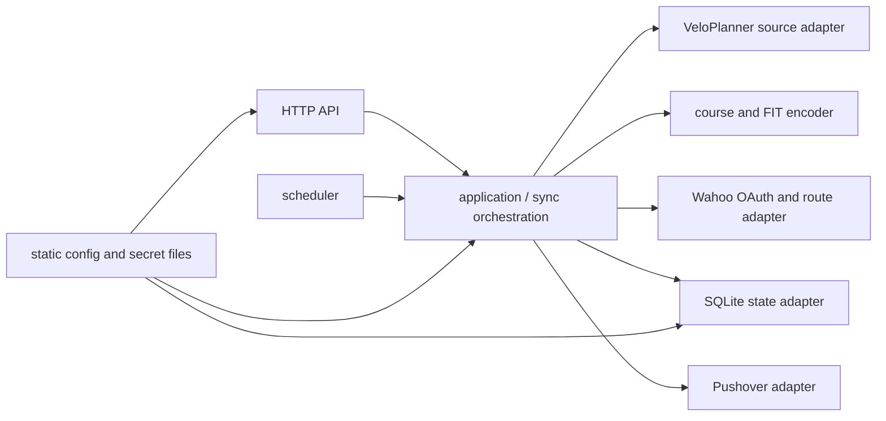

# Domestique service specification

**Status:** accepted v1 design

This document is the normative contract for the first Domestique service.
Where implementation details differ from this document, this document wins
until it is deliberately revised.

## Purpose and scope

Domestique mirrors the complete route library of one private VeloPlanner
account to two separately authorised Wahoo accounts. It runs automatically and
uploads device-ready FIT courses directly to Wahoo; Ride with GPS is not part
of the service.

Each VeloPlanner route stage is a separate Wahoo route. A single-stage route
keeps its route name. A multi-stage route uses `Route — Stage` so its stages are
individually identifiable on a device.

The service is a single-tenant Docker workload for a Raspberry Pi on the
Tailnet. It has no CLI and no frontend. Its HTTP surface is read-only JSON for
status and route data, except for the protected Wahoo OAuth onboarding flow.
Route preview and editing are explicitly out of scope for v1.

## Constraints and non-goals

- Sync every route in the configured VeloPlanner library; v1 has no selection
  by tag, prefix, or allow-list.
- Preserve no integration with Ride with GPS.
- Do not provide a manual sync trigger, route editing, a browser UI, or a
  command-line interface.
- Do not run a secret manager or reference a specific secret provider from Go.
- Do not back up the persistent service data. Recovery must be safe despite
  that intentional constraint.
- Do not include credentials, OAuth tokens, personal route fixtures, or the
  Wahoo client secret in this public repository.

## Deployment and access model

Docker publishes the service port only to the Raspberry Pi's `127.0.0.1`; the
container has no public host port. The Raspberry Pi exposes it privately through
`tailscale serve`; it is never directly published to the Internet. All service
endpoints require the configured sole Tailnet identity, apart from a
loopback-only liveness probe if one is needed by Docker. The HTTP server trusts
Tailnet identity headers only from that local proxy.

The Wahoo OAuth redirect URI is the service's HTTPS Tailnet URL:

```text
https://<device>.<tailnet>.ts.net/oauth/wahoo/callback
```

It must exactly match the URI registered with Wahoo and configured in the
service. The authorisation redirect is followed by the user's browser; Wahoo
does not need a public connection to the Pi.

The only state-changing HTTP interaction is the OAuth flow:

- `GET /oauth/wahoo/start/{target}` starts authorisation for a configured target
  slot.
- `GET /oauth/wahoo/callback` validates a one-time, expiring OAuth state and
  stores the resulting refresh token.

Both are limited to the configured Tailnet identity. The state binds the
calling identity and target slot and prevents cross-account or CSRF callbacks.
The service rejects an attempt to authorise the same Wahoo account for two
target slots.

The read-only JSON surface is deliberately small:

- `GET /healthz` reports local process health.
- `GET /v1/status` reports current configuration readiness, last sync outcome,
  aggregate counts, and target authorisation state.
- `GET /v1/routes` lists known source routes and stages.
- `GET /v1/routes/{source-route-id}/stages/{stage}` returns stored route
  metadata, not edit controls.

Exact response schemas are an implementation follow-up. They must never expose
secrets, tokens, raw upstream response bodies, or full route geometry.
The concrete OAuth, sync, persistence, and JSON contracts are defined in the
[sync lifecycle specification](sync-lifecycle.md).

## Configuration and secrets

The concrete file schema and validation rules are defined in the
[configuration specification](configuration.md).

The service has a provider-neutral configuration contract:

- One read-only static configuration file holds non-secret values: VeloPlanner
  account identity and endpoint, Wahoo client ID and API endpoints, target slot
  labels, Tailnet identity, sync cadence, deletion limit, data path, and public
  callback URL.
- Sensitive static values are loaded by Koanf from Docker-style files or the
  documented direct environment variables: VeloPlanner credentials, Wahoo
  client secret, Pushover application token and user key, and a 32-byte
  state-encryption key.
- Dynamic Wahoo refresh tokens are not static configuration. They are encrypted
  at rest in the local state database with an authenticated cipher and the
  state-encryption key. Access tokens are held only in memory.
- Configuration must not understand `op://`, `env:`, provider URIs, provider
  credentials, fnox, or another provider-specific reference syntax. The service
  stays CGO-free.

Docker Secrets, read-only bind mounts, and direct environment values are valid
secret sources. A deployment tool such as `fnox` may provision files, but does
not become an application dependency.

The static configuration defines two named Wahoo target slots. The target's
actual Wahoo user identity is learned and persisted during OAuth onboarding.
Sync remains disabled until both configured targets are authorised.

## Persistent state and recovery

A SQLite database on a Docker volume stores:

- Wahoo target identities and encrypted refresh tokens;
- source route/stage identity, source revision, content hash, and Wahoo
  `external_id`;
- the corresponding remote Wahoo route identity where available;
- last successful source inventory and last sync outcome; and
- expiring OAuth states.

The database holds no plaintext credential or token. It is intentionally not
backed up.

If the database or volume is lost, the operator must re-authorise both Wahoo
targets. The service must reconcile using the Domestique-owned `external_id`
before it creates or removes routes. It must not treat lost local state as
authority to delete routes from a Wahoo account.

## Source and course representation

VeloPlanner is an unofficial, session-cookie-based source integration using a
private account's username and password. Every sync obtains a fresh authenticated
session before listing routes. The source adapter must retain the proven
baseline behaviour for route geometry:

- read VeloPlanner's ordered stages and segments;
- join each stage's decoded `[longitude, latitude, elevation]` points in order;
- preserve elevation when present;
- emit one course per non-empty stage; and
- use the source route ID and stage order as stable identity, never the route
  title.

The service generates valid FIT courses. The initial FIT adapter may use
[`github.com/muktihari/fit`](https://github.com/muktihari/fit), isolated behind
the course encoder boundary and without vendoring Garmin SDK files or test data.
The source code remains MIT-licensed; third-party notices remain with their
respective dependencies. Operating the service requires compliance with the
[FIT Protocol License](https://www.thisisant.com/developer/ant/licensing/flexible-and-interoperable-data-transfer-fit-protocol-license).

Before adopting an encoder, an acceptance test must decode the generated FIT,
upload it to the Wahoo sandbox, and confirm the resulting course is usable by a
Wahoo account. No personal route data belongs in repository fixtures.

## Wahoo synchronisation

Wahoo is the only destination. The service uses the approved confidential Wahoo
Cloud application with `routes_read`, `routes_write`, and `user_read` scopes.
The configured Wahoo environment may be sandbox; it is valid for this service
within its lower rate limits.

For every source stage and Wahoo target, Domestique derives a deterministic
`external_id` from the source route ID and stage order. It supplies that ID and
the source revision as `provider_updated_at` when it creates or updates a FIT
route. A changed source stage updates the existing owned Wahoo route rather
than using an upload-and-delete replacement.

OAuth refresh is serialised per Wahoo account. A refresh token returned by a
successful refresh replaces the prior stored token atomically before any later
request can use stale credentials. The Wahoo application is rate-limited across
both targets: API calls are serial, obey advertised limits, and resume only
when safe to do so.

Domestique deletes only Wahoo routes it owns through its `external_id`. A
source-stage deletion removes the corresponding owned Wahoo route from both
targets. It never deletes manually created Wahoo routes.

## Sync lifecycle and safety

The detailed state transitions and safety gates are defined in the
[sync lifecycle specification](sync-lifecycle.md).

The service attempts one sync shortly after a healthy startup and then hourly.
At most one sync may run at a time. It fetches the source inventory once, then
processes the two Wahoo targets serially so one account's failure does not stop
an attempted update of the other. The overall run is failed if either target
fails.

No automatic run may delete more than five owned Wahoo routes from a target.
Before any deletion, the source inventory is checked against the last trusted
inventory. Authentication failure, malformed source data, an empty result after
a previously non-empty library, or a suspicious shrink stops deletion and raises
an alert. A normal small, authenticated source deletion is mirrored.

Source authentication and inventory safety are more important than making a
deletion immediate. A final-library deletion that would appear as an empty
source requires an explicit static configuration acknowledgement before it can
delete Wahoo routes.

Every run records a terminal outcome. Pushover receives:

- a concise aggregate success notification after every successful sync; and
- the first failure notification immediately, followed by suppression of
  identical failures for six hours.

Notifications contain aggregate counts and a safe failure category only. They
contain no route names, tokens, credentials, or raw upstream errors.

## Go design

The concrete package boundaries, interface rules, manual composition root, and
delivery sequence are defined in the
[implementation architecture specification](implementation-architecture.md).

The implementation is package-oriented with manual wiring in the server
entrypoint. Packages own their own data types and expose narrow interfaces only
at consumer boundaries. There is no dependency-injection framework, shared
`interfaces` package, or global service locator.

The intended dependency direction is:



`application` defines the source, destination, state, and notification
interfaces it consumes. Adapters do not import each other. `cmd/domestique`
only loads configuration, constructs concrete adapters, starts the scheduler,
and performs graceful shutdown.

## Quality and delivery requirements

Implementation must include a project-local Go toolchain declaration, focused
`golangci-lint` configuration, `prek` local checks, and GitHub Actions that run
the same essential validation. Normal tests use deterministic fakes for every
external service. A separately invoked sandbox acceptance check validates the
FIT/Wahoo contract and never receives production secrets through CI.

Released Docker images are published to GHCR from version tags, signed, and
deployed to the Pi by immutable digest. The Pi configuration and Docker secret
files remain outside this repository.

## Acceptance criteria

- Two Wahoo accounts can be authorised through the Tailnet-only OAuth flow.
- An hourly run mirrors every valid VeloPlanner stage to both targets as FIT.
- Edits preserve the stage's `external_id`; source deletions remove only owned
  destination routes and respect the deletion guard.
- A failed source inventory cannot cause a destructive Wahoo deletion.
- Lost state cannot cause deletion of unknown Wahoo routes.
- The service logs and notifications do not reveal secrets or route details.
- All non-OAuth HTTP interactions are read-only and Tailnet-identity-gated.
- The codebase has reproducible local and GitHub validation before a release is
  published.
